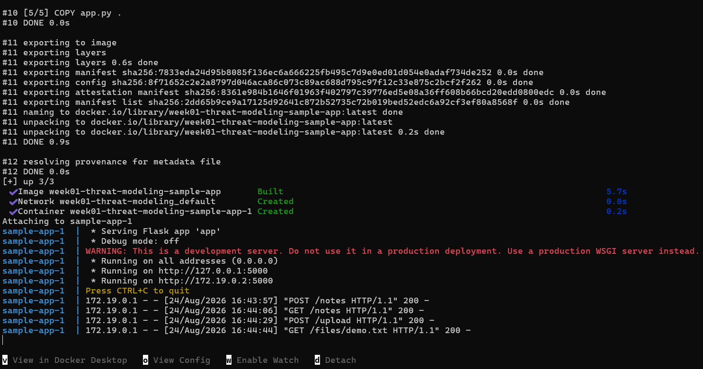
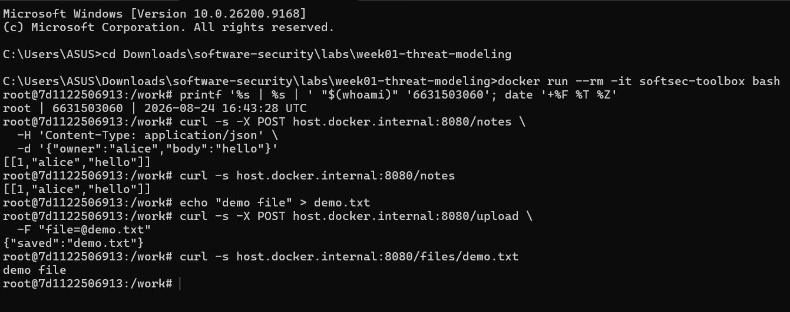
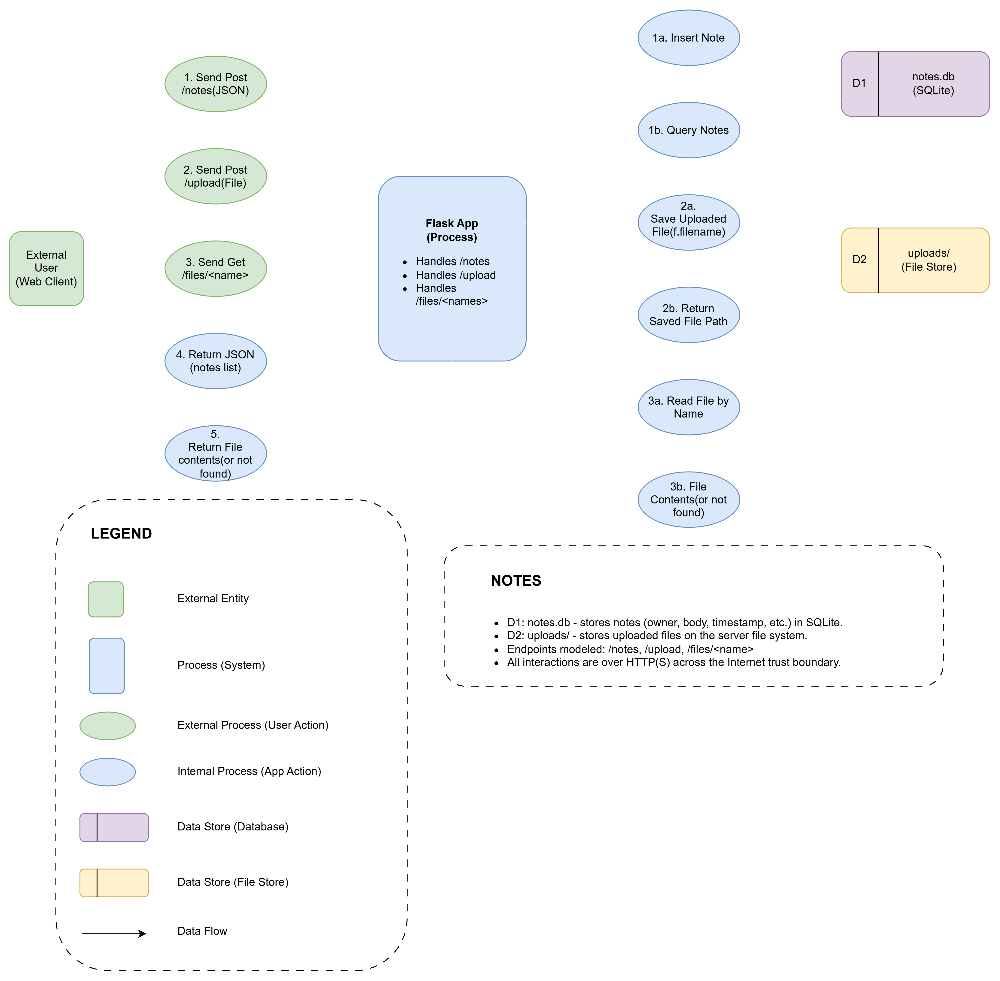
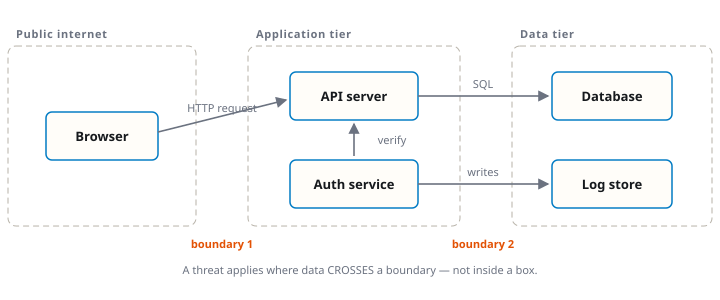
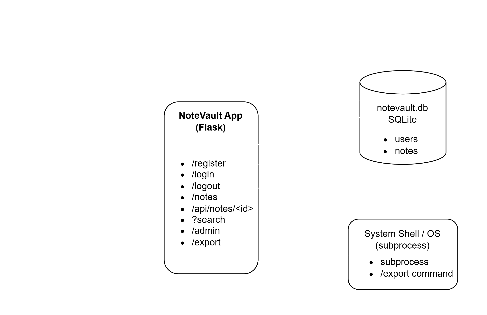

# Worksheet 1 — Security Mindset & Threat Modeling (3 hrs)

> **Course:** Software Security (KOSEN69) · **Week 1**
> **Aligned to:** OWASP 2025 A06 Insecure Design · CWE-501 (Trust Boundary Violation)
> **Signature game:** "Elevation of Privilege" (Microsoft STRIDE card deck)

> **Ethics note:** This week is *modeling only* — you analyze design, you do **not** attack the app. Run the sample app only on your own VM/localhost. Never apply these techniques to systems you do not own or lack written permission to test.

## Part 1 — Student Information
| Name | Student ID | Date | Group |
|---|---|---|---|
|Kay Khine Maw |6631503060 |24 Aug 2026 | |

## Part 2 — Lecture Questions
Answer in your own words (2–4 sentences each).
1. Define the CIA triad and give one concrete failure example for each of the three properties.
2. What is a *trust boundary*, and why does data crossing one deserve extra scrutiny?
3. Explain "attack surface." Name two things that increase it in a web app.
4. What does each STRIDE letter map to, and which security property does each threat violate?
5. What does "Secure by Design" (CISA) mean, and how does it differ from bolting security on after release?

### Part 2 — Answers
1. The CIA triad stands for Confidentiality, Integrity, and Availability. Confidentiality fails when private data is exposed, such as leaked passwords. Integrity fails when someone changes data without permission, such as modifying a bank balance. Availability fails when users cannot access a service, such as during a DDoS attack.

2. A trust boundary is a point where data moves between systems or areas with different levels of trust. For example, data moving from a user's browser to a web server crosses a trust boundary. This data needs extra checking because it may contain malicious or unexpected input.

3. The attack surface includes all the possible points where an attacker could try to enter or attack a system. In a web app, adding more API endpoints increases the attack surface. Using more third-party services or dependencies can also create additional security risks.

4. STRIDE is a method used to identify security threats:

- **S – Spoofing:** Pretending to be another user → violates **Authentication**
- **T – Tampering:** Changing data without permission → violates **Integrity**
- **R – Repudiation:** Denying an action without proof → violates **Non-repudiation**
- **I – Information Disclosure:** Exposing private information → violates **Confidentiality**
- **D – Denial of Service:** Making a system unavailable → violates **Availability**
- **E – Elevation of Privilege:** Getting permissions you should not have → violates **Authorization**

5. Secure by Design means security is considered from the beginning when designing and developing a system. Developers identify risks, use secure defaults, and reduce weaknesses before the product is released. This is different from adding security after release, when vulnerabilities may already exist and can be harder to fix.

## Part 3 — Hands-on Lab (180 min)
**Learning goals:** build a data-flow diagram (DFD), apply STRIDE to a real Flask app, rank risks, and propose mitigations.
**Prerequisites:** Docker + Docker Compose in your VM; a drawing tool (draw.io / paper + photo); the Elevation of Privilege deck (print or virtual) — free print-and-play PDF at [github.com/adamshostack/eop](https://github.com/adamshostack/eop).

**Environment setup**
```bash
cd labs/week01-threat-modeling
docker compose up --build           # starts sample-app on http://localhost:8080
curl -s -X POST localhost:8080/notes -H 'Content-Type: application/json' \
     -d '{"owner":"alice","body":"hello"}'   # observe behavior, do not attack
curl -s localhost:8080/notes

echo "demo file" > demo.txt
curl -s -X POST localhost:8080/upload -F "file=@demo.txt"   # observe behavior, do not attack
curl -s localhost:8080/files/demo.txt
```

Source to model lives in `sample-app/app.py`. Template to fill: `THREAT-MODEL-TEMPLATE.md` (copy it, do not edit the original).

**What to submit per task:** the threat/element identified + a screenshot (DFD, table, or running app) + a 2–3 sentence mitigation.

**Task 0 — Onboarding (5 min)** · *Goal:* prove the environment works. *Steps:* `docker compose up`, hit `/notes` and `/files/<name>`, read `sample-app/app.py`. *Deliverable:* screenshot of the running app + the JSON response.




---

**Task 1 — Draw the DFD (25 min)** · *Goal:* map the system. *Steps:* identify the external entity (web client), the process (Flask app), the data store (`notes.db` SQLite), the `uploads/` store, and the flows for `/notes`, `/upload`, `/files/<name>`; mark the Internet→app trust boundary with a dashed line. *Deliverable:* DFD image embedded in your copy of the template.


---

**Task 2 — STRIDE the elements (30 min)** · *Goal:* enumerate threats per element. *Steps:* for each element fill the S/T/R/I/D/E grid. Ground it in real code: `/notes` accepts a client-supplied `owner` with no auth (Spoofing); `/upload` saves raw `f.filename` — arbitrary-file-write (Tampering) — and echoes the resolved save path back in its response (Information disclosure); `/files/<name>` reads it back but is comparatively defended (see Task 5); no logging anywhere (Repudiation). *Deliverable:* completed STRIDE table.

| Element | S — Spoofing | T — Tampering | R — Repudiation | I — Information Disclosure | D — Denial of Service | E — Elevation of Privilege |
|---|---|---|---|---|---|---|
| `/notes` | A client can claim any `owner` because there is no authentication. | A client can submit or change note content using user-controlled input. | There is no logging, so there is no reliable record of who created a note. | Notes may be returned without checking whether the requester is allowed to see them. | Many note requests could consume server or database resources. | No clear EoP issue is shown directly by the provided code description. |
| `/upload` | There is no authentication to verify who is uploading the file. | The app saves raw `f.filename`, which can allow an arbitrary file write. | Uploads are not logged, so there is no reliable record of who uploaded a file. | The response reveals the resolved server-side save path. | Large or repeated uploads could consume disk space and server resources. | No clear EoP issue is shown directly by the provided code description. |
| `/files/<name>` | No specific spoofing issue is identified for this endpoint in the worksheet. | This endpoint is comparatively defended against unsafe file paths. | File access is not logged, so users could deny accessing a file. | A requested stored file is returned to the client, although the endpoint is comparatively defended. | Repeated file requests could consume server resources. | No clear EoP issue is identified for this endpoint in the worksheet. |

---

**Task 3 — Elevation of Privilege game (20 min)** · *Goal:* find threats you missed. *Steps:* play the EoP deck against your DFD; each card you can tie to a real element/flow scores a point; record every valid threat. No printer or scissors? Draw from the digital deck below instead — same 78 cards, same rule. *Deliverable:* list of carded threats + score.

```sim
eop-deck
```
| Card | DFD Element / Flow | Valid Threat |
|---|---|---|
| 4 of Spoofing | Web Client → `/notes` | An attacker can connect anonymously because `/notes` has no authentication and accepts a client-supplied `owner`. |
| 10 of Spoofing | `/notes` | An attacker can effectively use no authentication and claim another user's identity through the `owner` field. |
| J of Tampering | `/upload` → `uploads/` | An attacker can write to a resource because the application accepts an uploaded file and uses the client-controlled filename when saving it. |
| Q of Tampering | Web Client → Flask App | An attacker can change parameters while they cross the Internet-to-app trust boundary, including the note `owner` and uploaded filename. |
| Repudiation | Flask App | Actions are not logged, so a user can deny creating a note, uploading a file, or accessing a file. |
| Information Disclosure | `/upload` response | The application returns the resolved save path, revealing information about the server's internal filesystem. |
| Denial of Service | `/upload` → `uploads/` | Repeated or large file uploads could consume storage or application resources and reduce availability. |

- **Score: 7 points**

---

**Task 3b — Systems-level pass (25 min) 🔭** · *Goal:* find what the per-element grid cannot see. Tasks 2 and 3 enumerate threats **one element at a time**, and that is exactly where threat models are known to stop short — students taught STRIDE alone reliably identify component threats and *discount system-level ones* ([Joshi et al., ASEE 2024](https://arxiv.org/abs/2404.16632)). So do a second pass over the **whole** diagram:


- **Trust boundaries end-to-end.** Follow one request from the client to `notes.db` and back. List every boundary it crosses. Which crossing has no check on it?
- **Assume one element is fully owned.** Pick the Flask process, then the `uploads/` store. For each: what does the attacker now *reach* — not what is it, but where does it get them?
- **Chain two "low" findings.** Find two threats you or the EoP deck rated minor that combine into something you would not accept. Write the chain as `A → B → consequence`.
- **One-line system claim.** Finish: "Even if every element-level mitigation in Task 8 is implemented, this system still fails if ___."

Use the simulation below before you start — toggle a component to attacker-controlled and watch what it reaches:

```sim
trust-boundary
```

*Deliverable:* the boundary list, two owned-element reachability notes, one written chain, and the system claim.

1. Trust Boundaries End-to-End

For a request to `/notes`, the flow is:
`Web Client → Internet/App Trust Boundary → Flask App → notes.db → Flask App → Internet/App Trust Boundary → Web Client`
The main boundary crossing is from the untrusted web client into the Flask application. This crossing has the weakest check because `/notes` accepts the client-supplied `owner` value without authenticating whether the requester really owns that identity.

2. Assume One Element Is Fully Owned

- Flask Process Fully Owned
If the Flask process is fully compromised, the attacker can reach both internal data stores. They could access or modify `notes.db`, read or change files in `uploads/`, and control the responses sent back to the web client.

- `uploads/` Store Fully Owned
If the `uploads/` store is fully controlled by an attacker, they can replace, delete, or modify stored files. Because `/files/<name>` reads files from this store, the attacker could cause legitimate users to receive attacker-controlled or corrupted content.

3. Chain Two Low Findings

`No authentication on /notes → client controls the owner field → attacker creates notes under another user's identity`
Another possible chain is:
`No logging → unauthorized note creation → attacker can deny performing the action`
The second chain becomes more serious because the system has no reliable evidence showing who performed the unauthorized action.

4. One-Line System Claim

Even if every element-level mitigation in Task 8 is implemented, this system still fails if the Flask application itself becomes fully compromised and still has unrestricted access to both internal data stores.

---

**Task 4 — Abuse cases & attacker personas (20 min)** · *Goal:* think like specific adversaries. *Steps:* define 2 personas (e.g. a curious logged-in user; an anonymous internet attacker) and write 2 abuse cases each against the sample app, tied to DFD elements. *Deliverable:* 4 abuse cases.

**Persona 1 — Curious User**

A curious user has normal access to the web application but tries to access or modify data that should belong to someone else.

- Abuse Case 1 — Fake note owner  
DFD element: `/notes`  
The user sends a note request with another person's name in the `owner` field. Because the Flask app does not authenticate the supplied owner, the note may be accepted under someone else's identity.

- Abuse Case 2 — Access another user's file 
DFD element: `/files/<name>` and `uploads/`  
The user requests a stored file that they did not upload. If file access is not tied to user authorization, the application may return a file belonging to another user.

**Persona 2 — Anonymous Internet Attacker**

An anonymous attacker has no valid account and sends requests directly to the Flask application's exposed endpoints.

- Abuse Case 3 — Abuse file upload path  
DFD element: `/upload` and `uploads/`  
The attacker submits a file with a crafted filename so that the server may save it outside the intended upload directory. This is possible because the application uses the client-controlled `f.filename` when saving the file.

- Abuse Case 4 — Exhaust server resources 
DFD element: `/upload` and Flask App  
The attacker repeatedly uploads large files or sends many requests to consume disk space and server resources. This could make the application slow or unavailable to legitimate users.

---

**Task 5 — Path-traversal deep-dive (25 min)** · *Goal:* analyze the riskiest flow. *Steps:* trace `/upload` → `/files/<name>`; explain how `../` in a filename escapes `uploads/`; sketch the secure design (`secure_filename`, store outside web root, allow-list extensions). *Deliverable:* the data flow + secure-design note.

**Data Flow**

`Web Client → POST /upload → Flask App → uploads/ → GET /files/<name> → Flask App → Web Client`

The `/upload` endpoint accepts a file from the client and saves it using the client-supplied filename. Later, `/files/<name>` reads a file from the `uploads/` directory and returns it to the client.

Why `../` Is Dangerous : If the application uses a filename such as `../example.txt` directly when building the save path, the `../` tells the filesystem to move up one directory. This means the final path may escape the intended `uploads/` folder and point somewhere else on the server.

For example:

`uploads/ + ../example.txt → example.txt outside uploads/`

This is dangerous because untrusted input is being used as part of a filesystem path.

**Secure Design Note**

The application should use `secure_filename()` to sanitize uploaded filenames before saving them. It should also allow only approved file extensions, such as `.txt` or `.pdf`, and store uploaded files in a controlled directory outside the web root.

A stronger design is to generate the stored filename on the server instead of trusting the user's original filename. This reduces the chance that user-controlled input can affect filesystem paths.

---

**Task 6 — Threat-model the project target (30 min)** · *Goal:* kick off your term project. *Steps:* stop the sample-app first (`docker compose down` — both apps bind host port 8080), then run **NoteVault** (`cd ../../project/starter-app && docker compose up`), draw a quick DFD, and list the top 3 STRIDE threats you'd investigate. *Deliverable:* NoteVault DFD + top-3 threats (reuse these in your project report — `project/REPORT-TEMPLATE.md` in the repo root).

### Top 3 STRIDE Threats

| # | STRIDE Category | Element / Flow | Threat |
|---|---|---|---|
| 1 | Elevation of Privilege | `/register` | The client can provide the `role` value during registration. An attacker could register with the `admin` role and gain administrative privileges without authorization. |
| 2 | Information Disclosure | `/api/notes/<id>` | The endpoint checks whether the user is logged in but does not verify ownership of the requested note. An authenticated user could access another user's note by requesting its ID. |
| 3 | Elevation of Privilege / Tampering | `/export?fmt=...` → System Shell | The `fmt` parameter is inserted directly into a command executed with `shell=True`. An attacker could manipulate this input and cause the server to execute unintended commands with the Flask process's privileges. |

---

**Task 7 — Security requirements (15 min)** · *Goal:* turn threats into testable requirements. *Steps:* write 3 security requirements as acceptance criteria ("the system must … so that …"), each mapped to a threat from Task 2 or Task 6. *Deliverable:* 3 testable security requirements.

1. **The system must authenticate users and derive the note owner from the authenticated session so that a client cannot impersonate another user.**  
   **Mapped threat:** Task 2 — Spoofing on `/notes`

2. **The system must verify that the authenticated user owns a note before returning it through `/api/notes/<id>` so that users cannot access other users' notes.**  
   **Mapped threat:** Task 6 — Information Disclosure on `/api/notes/<id>`

3. **The system must avoid passing user-controlled input to shell commands and must use safe, predefined export formats so that attackers cannot execute unintended commands through `/export`.**  
   **Mapped threat:** Task 6 — Elevation of Privilege / Tampering on `/export?fmt=...`

---

**Task 8 — Defend / fix it: rank & mitigate (25 min) 🛡️** · *Goal:* turn threats into action you can prove. *Steps:* rank the top 5 threats by likelihood × impact; propose one concrete mitigation each (e.g., auth on `/notes`, `secure_filename()` + allowlist for `/upload`, request logging for Repudiation, size/rate limits for DoS). Then **pick one and actually implement it** in your fork.

*Deliverable — the top-5 table, plus for the one you implemented:*
1. the **diff** (commit hash on your `wk01` branch),
2. **evidence it works**: the request that succeeded before your change and is refused after — both outputs,
3. **why it closes the class, not the instance** (2–3 sentences). `secure_filename()` on one endpoint is an instance fix; *"no user-supplied string ever becomes a path component"* is a class fix. Say which yours is, and if it's an instance fix, say what the class fix would be.

> **Why this is weighted.** Fewer than half of working developers can spot a security hole in code, and being shown vulnerabilities does not by itself teach you to find or close them. Exploiting is the half that feels like progress; defending is the half that transfers to your job.

### Top 5 Threats

| Rank | Threat | Likelihood | Impact | Mitigation |
|---|---|---|---|---|
| 1 | Path traversal / arbitrary file write in `/upload` | High | High | Sanitize filenames with `secure_filename()`, use an extension allow-list, and reject unsafe names. |
| 2 | Spoofing on `/notes` because `owner` is client-controlled | High | High | Require authentication and derive the owner from the authenticated session instead of request data. |
| 3 | Information disclosure from `/upload` response | High | Medium | Do not return the resolved internal filesystem path to the client. |
| 4 | Repudiation because there is no logging | Medium | Medium | Add audit logging for note creation, uploads, downloads, and other important actions. |
| 5 | Denial of Service through large or repeated uploads | Medium | Medium | Set file-size limits and rate-limit repeated requests. |

 
 
 


My current fix is mainly an **instance fix** because `secure_filename()` and the extension allow-list are applied only to the `/upload` endpoint. A stronger **class fix** would enforce a rule across the whole application that no user-supplied string can ever be used directly as a filesystem path component, for example by generating server-side filenames and using one centralized safe file-storage function.

---

## Part 4 — Reflection
1. Map your top finding to a CWE and to OWASP A06 (Insecure Design); explain the mapping in one sentence.

- My top finding, the path-traversal/arbitrary-file-write risk in `/upload`, maps to **CWE-22: Improper Limitation of a Pathname to a Restricted Directory (Path Traversal)** and OWASP **A06: Insecure Design** because the application trusts a user-supplied filename as part of a filesystem path without enforcing a secure file-storage design.

2. Name one real-world breach caused by a design flaw (not a missing patch) and what design control would have prevented it.

- The **Capital One breach (2019)** involved weaknesses in the cloud architecture and access-control design that allowed an attacker to obtain credentials and access sensitive data. Stronger least-privilege controls and restrictions on what application credentials could access would have reduced or prevented the impact.

3. Of your five mitigations, which gives the most risk reduction per unit of effort, and why?

- Of my five mitigations, adding `secure_filename()` with a file-extension allow-list to `/upload` provides the most immediate risk reduction for relatively little implementation effort. It directly addresses the high-likelihood, high-impact path-traversal risk by preventing raw user-controlled filenames from being used directly as filesystem path components.

---

## Grading rubric (100)
| Criterion | Points |
|---|---|
| Lecture questions (Part 2) | 20 |
| Exploitation + evidence (DFD + STRIDE table + EoP findings + screenshots) | 40 |
| Defense (top-5 ranking + mitigations) | 25 |
| Reflection (CWE/OWASP mapping + breach + best mitigation) | 15 |

**Assessed within the rows above** (they are not extra points — they are what those points are for):
- **Systems-level reasoning** (inside *Exploitation + evidence*, Task 3b): does the model reach past single elements to boundaries, reachability and chains? Scored with the STRIDE + systems-thinking rubrics of [Joshi et al. 2024](https://arxiv.org/abs/2404.16632).
- **Defensive proof** (inside *Defense*, Task 8): a claimed mitigation with no before/after evidence scores at most half. A mitigation you can show closing a *class* scores full.
- **Adversarial thinking** (across the whole sheet): do the abuse cases, personas and chains show you reasoning as an attacker with goals and constraints — or just listing categories? This is the course's central disposition and it is assessed, not assumed.

---

## Evidence & Integrity (required)

- **Identity proof:** every screenshot/diagram must show a terminal running `printf '%s | %s | ' "$(whoami)" '<YOUR-STUDENT-ID>'; date '+%F %T %Z'` **in the
  same image as the evidence**. When the evidence is a browser page, a DevTools panel or a
  rendered response, put that terminal **beside the browser and capture the whole screen** — a
  cropped window carries nothing that identifies you, and the lab's own output is
  byte-identical for the whole cohort *by design*, so the stamp is the only thing that makes
  the shot yours. Generic or borrowed evidence is not accepted.
- **Personalized flag (if this lab issues one):** ____________________
  *Flags are unique per student — submitting another student's flag is a violation. How to submit: **learn.zcr.ai/submit** (full guide: `SUBMISSION.md` in the repo root).*
- **Explain in your own words** *(graded on your reasoning, not copied text):*
  1. What did you do, and **why did the vulnerability work**?

  I tested the `/upload` endpoint and found that it used the user-supplied filename directly when saving files. The vulnerability worked because a filename containing `../` could change the save path and escape the intended `uploads/` directory.

  2. **Why does your fix actually stop it** — and what could still break it?

  My fix uses `secure_filename()`, checks the filename, and only allows approved file extensions before saving the file. This stops the tested path-traversal attempt, but it is still mainly an instance fix because other parts of the application could be vulnerable if they also use user-controlled input directly in filesystem paths.

---

## 🤖 Audit the AI (required)

AI is a power tool you must **distrust** — you are graded on your *critique*, not the AI's answer.

1. Ask an AI assistant to exploit **or** fix this week's vulnerability. Paste its full answer.

I asked an AI assistant to fix the unsafe file-upload vulnerability in the Week 1 Flask application.

The vulnerability happens because the application saves the uploaded file using the filename provided by the user. A simple fix is to sanitize the filename with Flask/Werkzeug's `secure_filename()` before saving it.

```bash
 from werkzeug.utils import secure_filename

 @app.route("/upload", methods=["POST"])
 def upload():
     f = request.files["file"]
     filename = secure_filename(f.filename)
     f.save(os.path.join(UPLOAD_DIR, filename))
     return {"saved": filename}
```

`secure_filename()` removes unsafe path characters such as `../`, so this prevents path traversal.

2. **Find what's wrong or risky** in it — insecure code, a subtly incomplete fix, a hallucinated API/function/CVE, a missed edge case, or wrong reasoning. Quote the exact line(s).

The AI's answer was incomplete because it relied only on this line:

> `filename = secure_filename(f.filename)`

Although `secure_filename()` removes dangerous path components, the code still accepts the modified filename instead of rejecting suspicious input. It also does not restrict the types of files that can be uploaded or check for missing and empty filenames.

The statement: ***"`secure_filename()` removes unsafe path characters such as `../`, so this prevents path traversal."*** is only partly sufficient. It protects this particular filename use, but it does not establish a broader rule that user-controlled strings must never directly determine filesystem paths.

3. Produce the **correct, verified** version yourself and explain in 2–3 sentences why the AI's output was insufficient.

```bash
from werkzeug.utils import secure_filename

ALLOWED_EXTENSIONS = {"txt", "pdf", "png", "jpg", "jpeg"}

def allowed_file(filename):
    return "." in filename and \
           filename.rsplit(".", 1)[1].lower() in ALLOWED_EXTENSIONS


@app.route("/upload", methods=["POST"])
def upload():
    if "file" not in request.files:
        return {"error": "file required"}, 400

    f = request.files["file"]

    if not f.filename:
        return {"error": "filename required"}, 400

    safe_name = secure_filename(f.filename)

    if safe_name != f.filename or not allowed_file(safe_name):
        return {"error": "unsafe filename"}, 400

    f.save(os.path.join(UPLOAD_DIR, safe_name))

    return {"saved": safe_name}
```
I verified that `demo.txt` still uploaded normally, while a filename containing `../` was rejected with `400 Bad Request`. The AI's fix was incomplete because it only sanitized the filename, while my version also validates input, restricts file types, and rejects unsafe filenames.

> Disclose your AI use in the Part 1 table. This task counts toward your **Defense + Reflection** score.

I used ChatGPT to help identify and review a possible fix for the file-upload vulnerability. I did not rely on the answer without checking it; I reviewed the suggested code, identified missing protections, implemented a stronger version, and verified the result in my own lab environment.

---

## 🧠 Comprehension & Prompt (required)

**A. Explain in Plain English (EiPE).** In 2–3 sentences, in your own words, describe what this week's vulnerable code/endpoint actually *does* and *why it is exploitable* — explain the mechanism, don't dump jargon.

The `/upload` endpoint takes a file from the user and saves it using the filename supplied by the user. This is exploitable because a filename containing `../` can change the save location and make the file escape the intended `uploads/` folder.

**B. Prompt Problem.** Write a **single prompt** that makes an AI produce a *correct, secure* fix for one finding. Run it: does the exploit now fail? If not, refine the prompt and try again. Submit the **final prompt + the verified result**.
*Graded on the prompt's precision and your verification — this trains problem decomposition and AI literacy (Denny et al. 2024).*

**Final Prompt:**

 Fix the Flask `/upload` endpoint so that user-supplied filenames cannot escape the `uploads/` directory. Use `secure_filename()`, reject unsafe or empty filenames, allow only `txt`, `pdf`, `png`, `jpg`, and `jpeg` files, and keep normal uploads working. Return `400 Bad Request` for unsafe filenames.

**Verified Result:**

I tested the fixed endpoint with a normal file, `demo.txt`, and it uploaded successfully. I then repeated the request using a filename containing `../`, and the server rejected it with `400 Bad Request` and `{"error":"unsafe filename"}`, so the exploit failed.

---
