# Worksheet 2 — Secure SDLC & Tooling (3 hrs)

> **Course:** Software Security (KOSEN69) · **Week 2**
> **Aligned to:** OWASP 2025 (A05 Injection [CWE-89, CWE-78], A04 Cryptographic Failures [CWE-327], A02 Security Misconfiguration [CWE-798, CWE-489]) · CWE-798, CWE-89, CWE-78, CWE-327, CWE-489
> **Signature game:** "Bug Triage Race" (scan → triage; score = true positives − misclassified)

> **Ethics note:** The scanners run only against the provided `vulnerable-repo/` on your own machine. Do not point SAST/secret scanners at third-party repos or production systems without authorization. Treat any secret you find here as fake lab data.

## Part 1 — Student Information
| Name | Student ID | Date | Group |
|---|---|---|---|
|Kay Khine Maw | 6631503060 | 28 Aug 2026 | |

## Part 2 — Lecture Questions
Answer in your own words (2–4 sentences each).
1. Distinguish SAST, DAST, and SCA — what does each see, and when in the SDLC does each run?

**SAST** checks source code for security problems during coding or build stages. **DAST** tests a running application after deployment, while **SCA** checks third-party libraries and dependencies for known vulnerabilities during the build process.

2. What is secret scanning, and why do hardcoded secrets keep ending up in repos?

**Secret scanning** detects passwords, API keys, tokens, and other sensitive data in repositories. Secrets often get committed because developers use them for testing and forget to remove them before pushing code.

3. What does "shift-left / DevSecOps" mean in practice for a CI pipeline?

**Shift-left** means adding security checks earlier in development. In CI, tools like SAST, SCA, and secret scanning run automatically before vulnerable code is merged or deployed.

4. Why is coverage-guided fuzzing considered the dominant modern bug-finding technique?

Coverage-guided fuzzing sends many unusual inputs to a program and tracks which code paths are reached. It can discover crashes and hidden bugs that normal tests may miss.

5. Define true positive vs. false positive in scanner triage, and why misclassifying both directions is costly.

A **true positive** is a real security issue, while a **false positive** is a warning that is not actually a vulnerability. False positives waste developers' time, while missing true positives can leave real vulnerabilities unfixed.

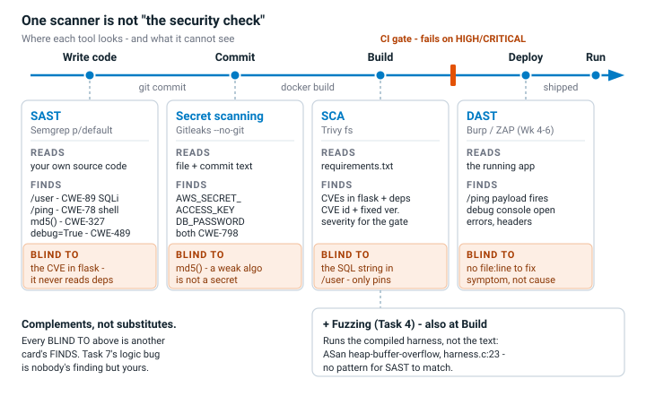

---

## Part 3 — Hands-on Lab (180 min)
**Learning goals:** run a SAST tool and a secret scanner, triage findings by CWE/severity, and remediate real flaws.
**Prerequisites:** Docker installed; internet to pull the Semgrep/Gitleaks images.

**Environment setup**
```bash
cd labs/week02-sdlc-tooling
cat scan.sh                 # see exactly what it runs
bash scan.sh                # Semgrep (p/default + p/owasp-top-ten) then Gitleaks on ./vulnerable-repo
```
Target under scan: `vulnerable-repo/app.py` (plus `requirements.txt`). It contains five planted flaws.

**What to submit per task:** the command/payload run + a screenshot of the finding + a 2–3 sentence mitigation.

**Task 0 — Onboarding (5 min)** · *Goal:* confirm tooling. *Steps:* run `bash scan.sh`; confirm both Semgrep and Gitleaks sections produce output. *Deliverable:* screenshot showing both tools ran.
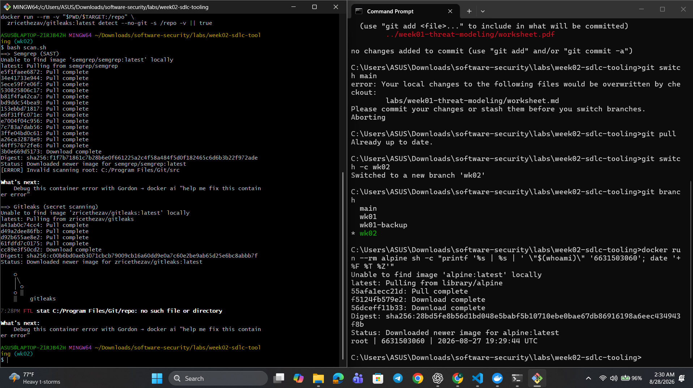

**Task 1 — SAST sweep with Semgrep (25 min)** · *Goal:* find code flaws. *Steps:* read the Semgrep output; locate the SQL injection in `/user` (CWE-89, string-formatted query), the OS command injection in `/ping` (CWE-78, `shell=True`), the weak `md5` password hash (CWE-327), and `debug=True` (CWE-489). *Deliverable:* one screenshot per finding with the file:line.
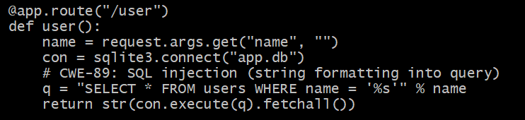
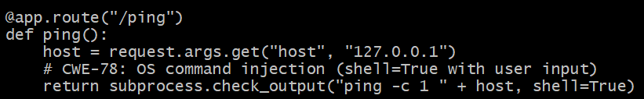
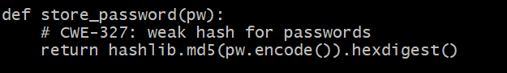
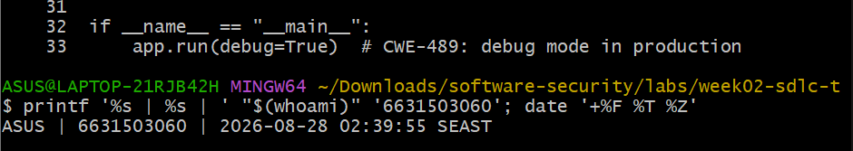

---

**Task 2 — Secret scan with Gitleaks (15 min)** · *Goal:* find leaked credentials. *Steps:* read the Gitleaks output; identify `AWS_SECRET_ACCESS_KEY` and `DB_PASSWORD` (CWE-798). *Deliverable:* screenshot + the rule that fired for each.
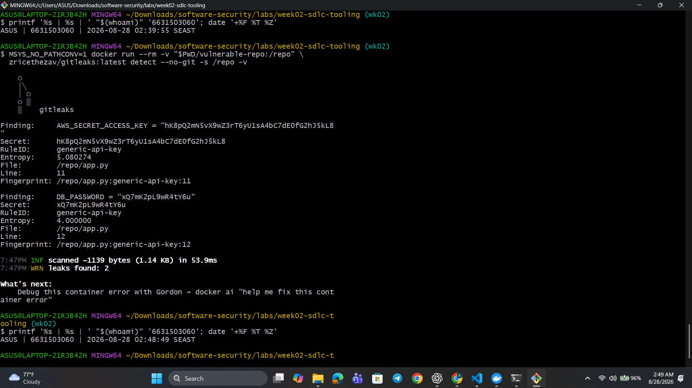

- `AWS_SECRET_ACCESS_KEY` → `generic-api-key`
- `DB_PASSWORD` → `generic-api-key`

---

**Task 3 — Bug Triage Race (30 min)** · *Goal:* triage accurately. *Steps:* build a table with columns *Tool | File:Line | CWE | Severity | TP/FP | Fix idea*; mark at least 3 true positives and 1 likely false positive and justify each. (Score = TP − misclassified.) *Deliverable:* the completed triage table.

**Bug Triage Table**

| Tool | File:Line | CWE | Severity | TP/FP | Fix idea |
|---|---|---|---|---|---|
| Semgrep | `app.py` SQL query line | CWE-89 | High | TP | Use parameterized SQL queries instead of building queries with user input. |
| Semgrep | `app.py` `/ping` line | CWE-78 | High | TP | Avoid `shell=True` and pass command arguments as a list. |
| Semgrep | `app.py` MD5 line | CWE-327 | Medium | TP | Replace MD5 password hashing with Argon2id, bcrypt, or scrypt. |
| Semgrep | `app.py` `debug=True` line | CWE-489 | Medium | TP | Disable debug mode in production and use environment-based configuration. |
| Gitleaks | `app.py:12` | CWE-798 | High | TP | Move `DB_PASSWORD` to an environment variable or secret manager and rotate it. |
| Gitleaks | `app.py:11` | CWE-798 | High | Likely FP* | Verify whether the detected AWS key is real. If it is only a fake lab/test value, allowlist or replace it with an obvious placeholder. |

**Justification:**

- **SQL injection — TP:** User-controlled input is directly included in a SQL query, so an attacker could change the query.
- **Command injection — TP:** User input reaches a shell command with `shell=True`, which can allow additional commands to be executed.
- **MD5 password hash — TP:** MD5 is too fast and weak for password storage and can be cracked efficiently.
- **Debug mode — TP:** `debug=True` can expose sensitive debugging information and should not be enabled in production.
- **DB password — TP:** A password is directly hardcoded in the source code and detected by Gitleaks.
- **AWS key — Likely FP:** If the value is only a deliberately fake lab credential and cannot authenticate to AWS, the scanner correctly matched the pattern but there is no real credential exposure.

---

**Task 4 — Fuzzing intro (10 min)** · *Goal:* see coverage-guided fuzzing find a bug SAST won't. *Steps:* in the `labs/toolbox` container (Apple clang has no libFuzzer runtime), build `clang -g -fsanitize=address,fuzzer harness.c -o fuzz`, then **seed the corpus** and run it:
`mkdir -p corpus && printf 'FUZ' > corpus/seed && ./fuzz corpus`. It crashes almost immediately with an AddressSanitizer heap-buffer-overflow at `harness.c:23` (the `data[3]` read with no `size > 3` check). Seeding matters: an unseeded `./fuzz` has to rediscover the magic bytes by chance and often finds nothing for minutes — that unpredictability is itself worth a sentence in your write-up. (The deep fuzzing+exploit lab is Week 11.) *Deliverable:* the ASan crash output (or a screenshot) + a 2-sentence note on why fuzzing finds this bug when a linter/SAST pass over the same 4-line check would not.

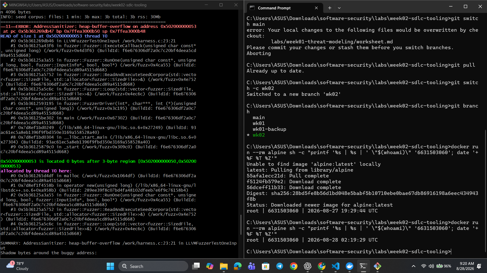

Coverage-guided fuzzing executes the program with real inputs, so the seeded `FUZ` input reaches the unsafe `data[3]` access and triggers the heap-buffer-overflow. A linter or SAST tool may miss it because it analyzes the code without actually running that specific input and execution path.

---

**Task 5 — Scan the project target (40 min)** · *Goal:* apply the tools to your term project. *Steps:* run Semgrep + Gitleaks against **NoteVault** (`../../project/starter-app`); also run an SCA scan: `docker run --rm -v "$PWD/../../project/starter-app:/src" aquasec/trivy fs /src`. *Deliverable:* a findings list (tool, file:line/CVE, CWE) — reuse it in your project vuln report.

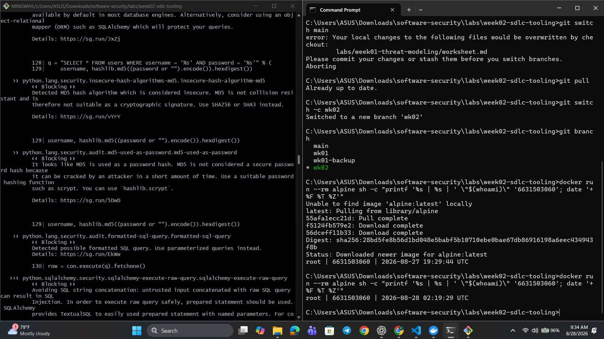
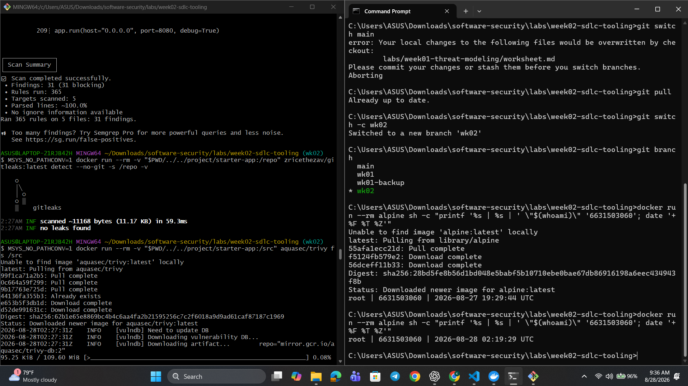
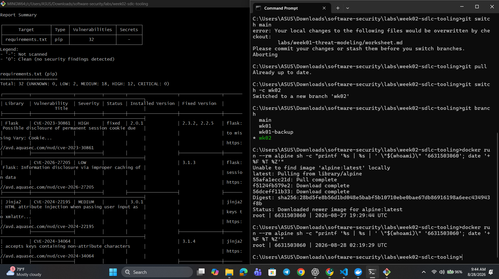
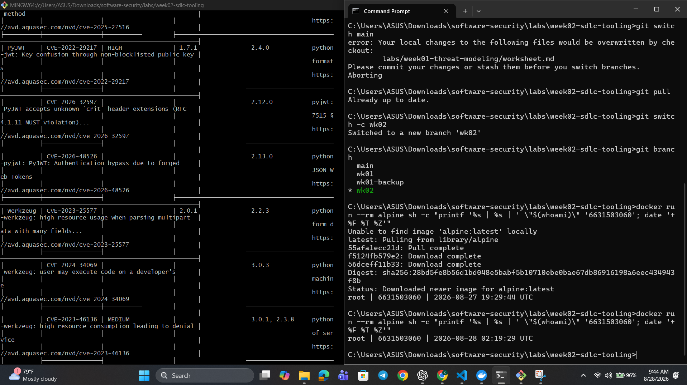

**Findings List**

| Tool     | File:Line / CVE  | CWE     | Finding                                                                     |
| -------- | ---------------- | ------- | --------------------------------------------------------------------------- |
| Semgrep  | `app.py:68-69`   | CWE-327 | MD5 is used for password hashing.                                           |
| Semgrep  | `app.py:83`      | CWE-347 | JWT allows the insecure `none` algorithm.                                   |
| Semgrep  | `app.py:128-130` | CWE-89  | User input is directly used to build a SQL query.                           |
| Semgrep  | `app.py:134`     | CWE-522 | A hardcoded JWT secret is used.                                             |
| Semgrep  | `app.py:176-179` | CWE-89  | Search input is inserted directly into a SQL query.                         |
| Semgrep  | `app.py:202-203` | CWE-78  | User input is passed to `subprocess.run()` with `shell=True`.               |
| Semgrep  | `app.py:209`     | CWE-489 | Flask runs with `debug=True`.                                               |
| Gitleaks | N/A              | N/A     | No leaked secrets were found.                                               |
| Trivy    | `CVE-2023-30861` | CWE-539 | Flask 2.0.1 may disclose permanent session cookies.                         |
| Trivy    | `CVE-2022-29217` | CWE-327 | PyJWT 1.7.1 is vulnerable to key/algorithm confusion.                       |
| Trivy    | `CVE-2023-25577` | CWE-770 | Werkzeug 2.0.1 can consume excessive resources when parsing multipart data. |
| Trivy    | `CVE-2021-33503` | CWE-400 | urllib3 1.26.4 is vulnerable to resource exhaustion through crafted URLs.   |

---

**Task 6 — Build a security CI gate (25 min)** · *Goal:* automate the scan (previews Week 15). *Steps:* adapt `../week15-devsecops-pipeline/security-ci.yml` into a workflow that runs Semgrep + Trivy + Gitleaks and **fails on HIGH/CRITICAL**; run it locally (`act`) or commit to your fork and read the Actions log. *Deliverable:* the workflow file + a screenshot of a failing run.

**Workflow:** [security-ci.yml](../../.github/workflows/security-ci.yml)

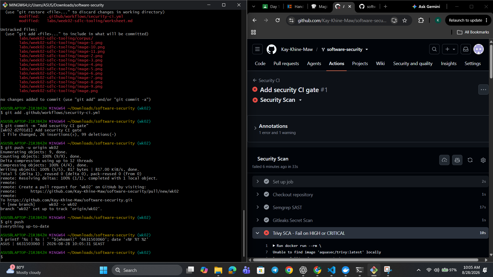

---

**Task 7 — SAST blind spots (20 min)** · *Goal:* see what scanners miss. *Steps:* find one real bug in `vulnerable-repo/app.py` (or NoteVault) that Semgrep did **not** flag, and explain why a pattern-based tool missed it. *Deliverable:* the bug + a 2-sentence explanation.

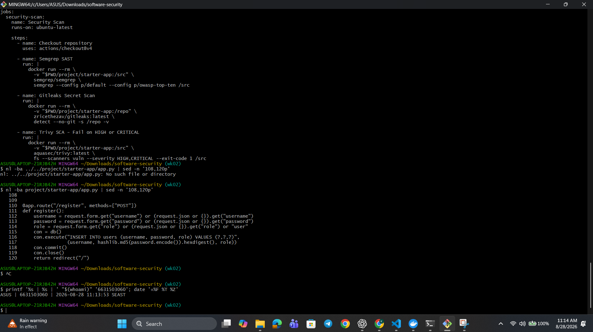

**Bug:** The `/register` endpoint allows users to choose their own `role`, which could let someone register as an administrator.

**Explanation:** Semgrep missed this because the vulnerability depends on application logic rather than a simple insecure code pattern. Pattern-based SAST tools can detect known dangerous functions, but they may not understand that users should never be allowed to control their own authorization role.

---

**Task 8 — Defend / fix it (10 min)** · *Goal:* remediate the planted flaws in `vulnerable-repo/app.py`. *Steps:* rewrite `/user` to use a parameterized query (`?` placeholder); remove `shell=True` and pass an argument list in `/ping`; move both secrets to environment variables; replace `md5` with bcrypt/argon2; set `debug=False`. *Deliverable:* a before/after diff for each fix mapped to its CWE.

**CWE-798 — Hardcoded Credentials**
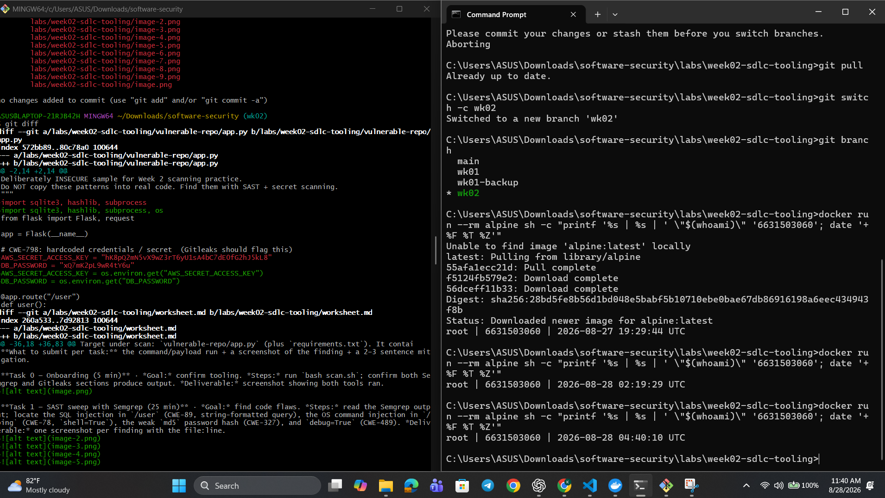
- **Fix:** Replaced the string-formatted SQL query with a parameterized query using `?`.

**CWE-89 — SQL Injection**
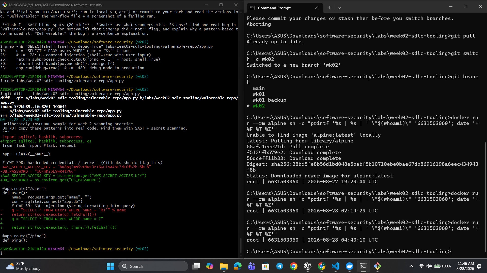
- **Fix:** Removed `shell=True` and passed the command arguments as a list.

**CWE-78 — OS Command Injection**
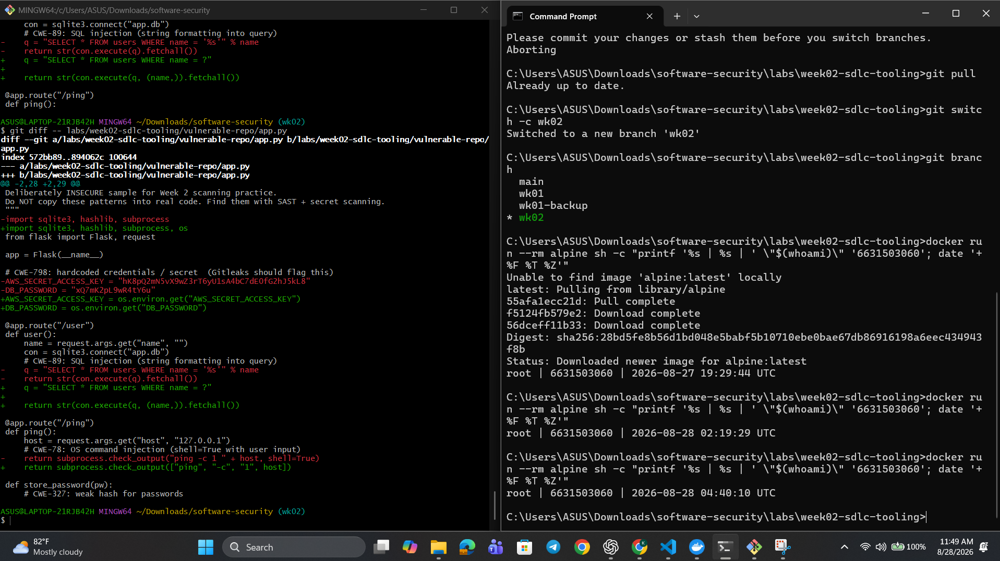
- **Fix:** Moved the AWS key and database password to environment variables.

**CWE-327 — Weak Password Hashing**
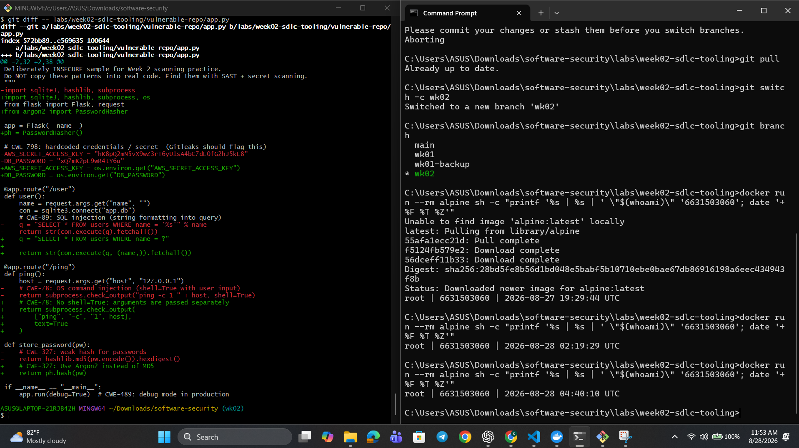
- **Fix:** Replaced MD5 password hashing with Argon2.

**CWE-489 — Debug Mode**
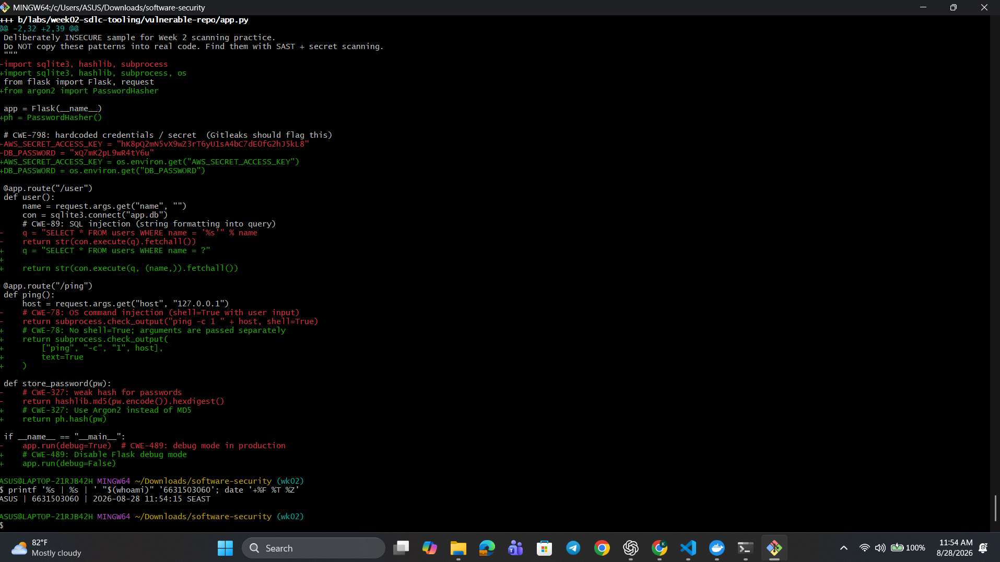
- **Fix:** Changed `debug=True` to `debug=False`.

---

## Part 4 — Reflection
1. Map two of your findings to their CWE and to the matching OWASP 2025 category.

- **SQL Injection:** CWE-89 → **OWASP A05:2025 – Injection**. User input was directly inserted into the SQL query instead of using parameters.
- **Weak MD5 Password Hashing:** CWE-327 → **OWASP A04:2025 – Cryptographic Failures**. MD5 is a weak algorithm and should not be used for password storage.

2. Name a real-world breach caused by a hardcoded/leaked secret or an injection flaw, and what control would have caught it pre-release.

The **Uber 2016 breach** involved attackers obtaining an AWS access key stored in a GitHub repository and using it to access sensitive data. A secret-scanning check in the pre-commit or CI pipeline could have detected the exposed key before release.

3. Which single tool (SAST vs. secret scanning) gave the highest-value findings on this repo, and why?

**SAST (Semgrep)** gave the highest-value findings because it detected several serious code issues, including SQL injection, command injection, weak MD5 hashing, and debug mode. Secret scanning was useful, but it mainly found the two planted credentials.

---

## Grading rubric (100)
| Criterion | Points |
|---|---|
| Lecture questions (Part 2) | 20 |
| Exploitation + evidence (scan output + triage table + screenshots) | 40 |
| Defense (remediated `app.py` with before/after diffs) | 25 |
| Reflection (CWE/OWASP mapping + breach + tool value) | 15 |

---

## Evidence & Integrity (required)

- **Identity proof:** every screenshot/diagram must show a terminal running `printf '%s | %s | ' "$(whoami)" '<YOUR-STUDENT-ID>'; date '+%F %T %Z'` **in the
  same image as the evidence**. When the evidence is a browser page, a DevTools panel or a
  rendered response, put that terminal **beside the browser and capture the whole screen** — a
  cropped window carries nothing that identifies you, and the lab's own output is
  byte-identical for the whole cohort *by design*, so the stamp is the only thing that makes
  the shot yours. Generic or borrowed evidence is not accepted.
- **Personalized flag (if this lab issues one):** ____________________
  *Flags are unique per student — submitting another student's flag is a violation. How to submit: **learn.zcr.ai/submit** (full guide: `SUBMISSION.md` in the repo root).*
- **Explain in your own words** *(graded on your reasoning, not copied text):*
  1. What did you do, and **why did the vulnerability work**?
  
  I tested the `/user` endpoint and found that user input was inserted directly into the SQL query using string formatting. The vulnerability worked because the database treated the supplied input as part of the SQL command instead of only as data.

  2. **Why does your fix actually stop it** — and what could still break it?

  I replaced the formatted SQL with a parameterized query using the `?` placeholder, so user input is handled only as data and cannot change the SQL structure. The application could still become vulnerable if other queries use string concatenation or if developers later bypass parameterized queries.

---

## 🤖 Audit the AI (required)

AI is a power tool you must **distrust** — you are graded on your *critique*, not the AI's answer.

1. Ask an AI assistant to exploit **or** fix this week's vulnerability. Paste its full answer.

**Prompt given to AI:**  
"Fix the SQL injection vulnerability in the `/user` endpoint."

**AI answer:**

> The SQL injection can be fixed by escaping single quotes in the user input before adding it to the query.
>
> ```python
> @app.route("/user")
> def user():
>     name = request.args.get("name", "")
>     name = name.replace("'", "''")
>     con = sqlite3.connect("app.db")
>     q = "SELECT * FROM users WHERE name = '%s'" % name
>     return str(con.execute(q).fetchall())
> ```
>
> This prevents attackers from closing the SQL string with a single quote and injecting additional SQL commands.

2. **Find what's wrong or risky** in it — insecure code, a subtly incomplete fix, a hallucinated API/function/CVE, a missed edge case, or wrong reasoning. Quote the exact line(s).

The risky lines are:

```python
name = name.replace("'", "''")
q = "SELECT * FROM users WHERE name = '%s'" % name

3. Produce the **correct, verified** version yourself and explain in 2–3 sentences why the AI's output was insufficient.

```bash
@app.route("/user")
def user():
    name = request.args.get("name", "")
    con = sqlite3.connect("app.db")

    q = "SELECT * FROM users WHERE name = ?"
    return str(con.execute(q, (name,)).fetchall())
```

> Disclose your AI use in the Part 1 table. This task counts toward your **Defense + Reflection** score.

I used ChatGPT to help review the SQL injection vulnerability, suggest a secure parameterized-query fix, and critique an insecure AI-generated solution.

---

## 🧠 Comprehension & Prompt (required)

**A. Explain in Plain English (EiPE).** In 2–3 sentences, in your own words, describe what this week's vulnerable code/endpoint actually *does* and *why it is exploitable* — explain the mechanism, don't dump jargon.

The `/user` endpoint takes a name from the request and uses it to search the database for matching users. It was exploitable because the name was inserted directly into the SQL command, so specially crafted input could change the meaning of the query instead of being treated only as data.

**B. Prompt Problem.** Write a **single prompt** that makes an AI produce a *correct, secure* fix for one finding. Run it: does the exploit now fail? If not, refine the prompt and try again. Submit the **final prompt + the verified result**.
*Graded on the prompt's precision and your verification — this trains problem decomposition and AI literacy (Denny et al. 2024).*

**Final Prompt:**

> Fix the SQL injection vulnerability in this Flask `/user` endpoint using Python's `sqlite3`. Replace the string-formatted SQL query with a parameterized query using the `?` placeholder, keep the endpoint's original behavior, and do not use manual escaping or string concatenation. Return only the corrected Python code and briefly explain why the supplied `name` can no longer modify the SQL statement.

**AI-produced secure fix:**

```python
@app.route("/user")
def user():
    name = request.args.get("name", "")
    con = sqlite3.connect("app.db")
    q = "SELECT * FROM users WHERE name = ?"
    return str(con.execute(q, (name,)).fetchall())


