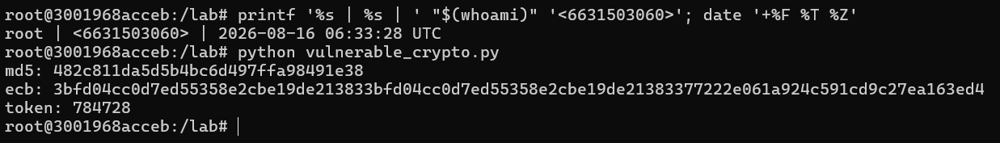
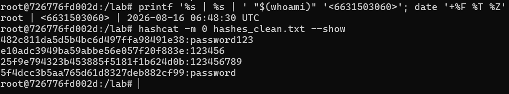
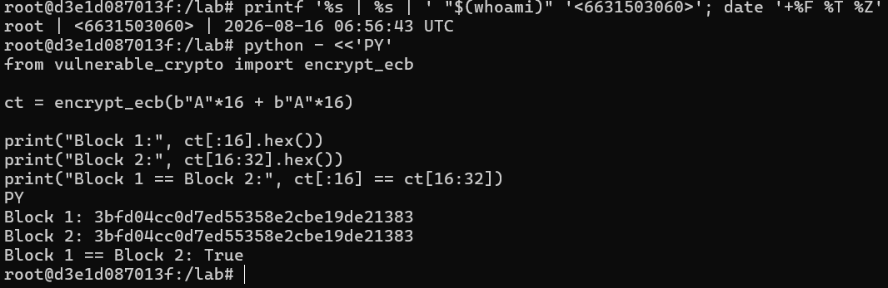
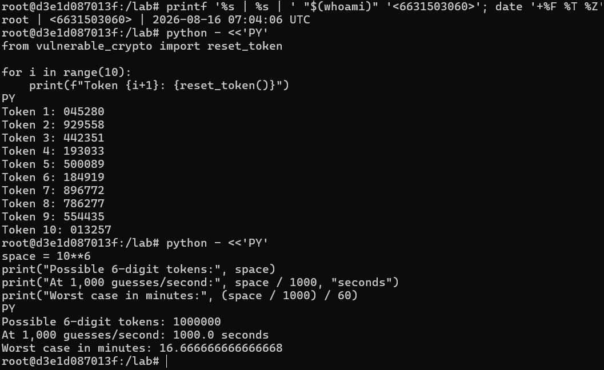
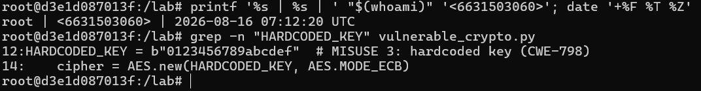
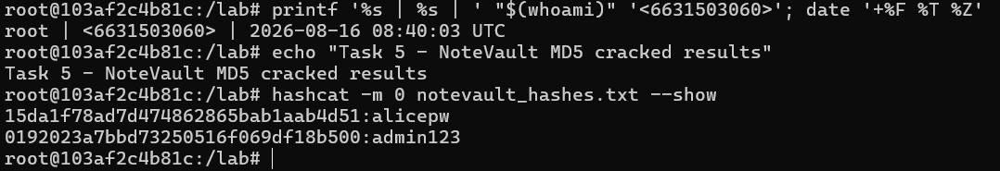
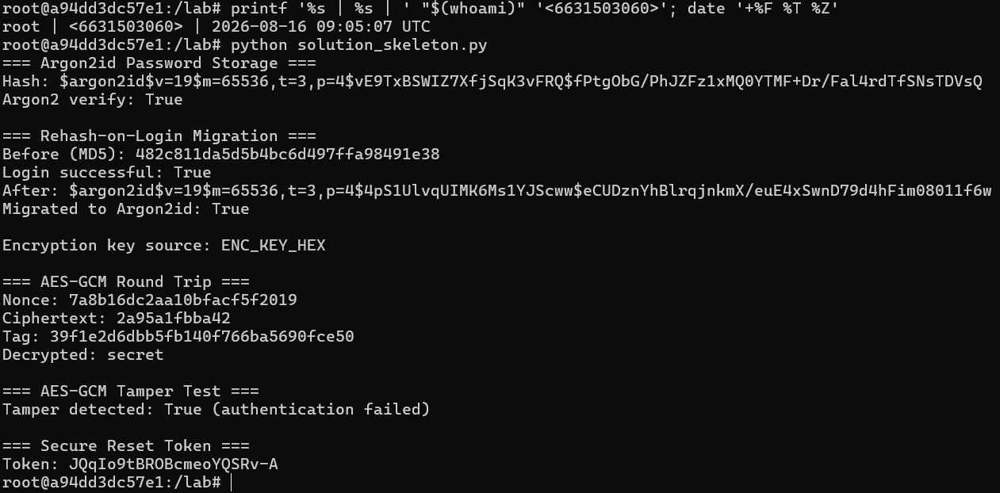
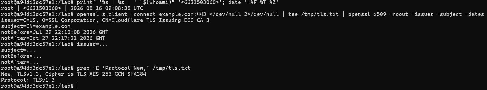
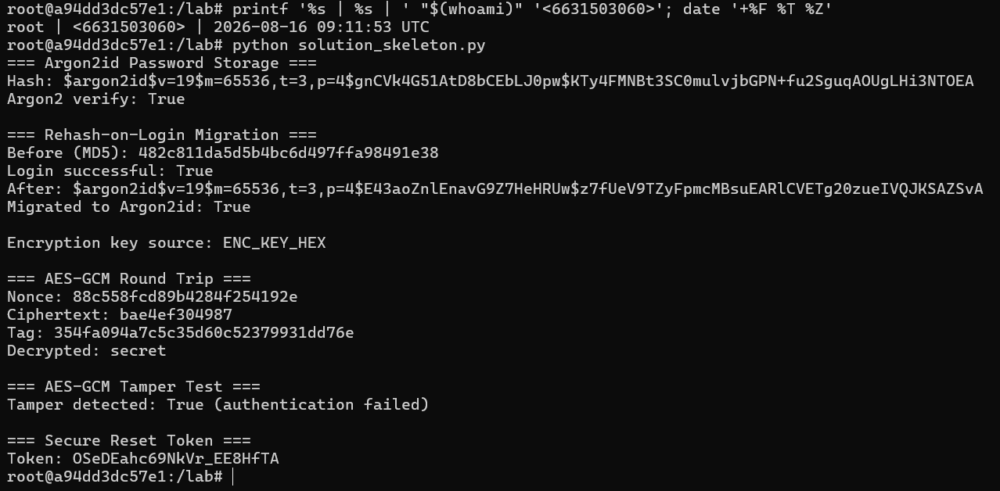

# Worksheet 3 — Cryptography Used Correctly (and Misused) (3 hrs)

> **Course:** Software Security (KOSEN69) · **Week 3**
> **Aligned to:** OWASP 2025 A04 Cryptographic Failures · CWE-327, CWE-916, CWE-330, CWE-798
> **Signature game:** "Capture the Hash" (recover plaintext from weak hashes)

> **Ethics note:** Crack only the hashes provided in `hashes.txt` on your own machine. Password-cracking against accounts or systems you don't own is illegal. Wordlists and recovered values stay inside the lab VM.

## Part 1 — Student Information
| Name | Student ID | Date | Group |
|---|---|---|---|
|Kay Khine Maw |6631503060 |16 August 2026 | |

## Part 2 — Lecture Questions
Answer in your own words (2–4 sentences each).
1. Distinguish hashing, encryption, and encoding — and give one job each is the wrong tool for.
2. Why is a fast hash like MD5/SHA-1 a bad choice for storing passwords, and what should be used instead?
3. What is a salt, what attack does it defeat, and why must it be unique per password?
4. Why does AES-ECB leak structure, and what does an authenticated mode like AES-GCM add?
5. What's the difference between `random` and a CSPRNG (e.g. `secrets`), and where does it matter?

### Part 2 - Answers
1. Hashing creates a one-way fingerprint, encryption protects data using a key, and encoding changes data into another format. Hashing is wrong for recoverable data, encryption is wrong for password storage, and encoding is wrong for protecting secrets.

2. MD5 and SHA-1 are too fast, so attackers can try many password guesses quickly. Passwords should be stored using a slow password-hashing algorithm like Argon2id, bcrypt, or scrypt.

3. A salt is a unique random value added to a password before hashing. It prevents rainbow-table attacks and ensures that the same passwords produce different hashes.

4. AES-ECB leaks patterns because identical plaintext blocks produce identical ciphertext blocks. AES-GCM avoids this problem and also provides authentication to detect modified data.

5. `random` is predictable and is not designed for security. A CSPRNG like `secrets` produces unpredictable values and should be used for reset tokens, session tokens, and other security-sensitive data.


## Part 3 — Hands-on Lab (180 min)
**Learning goals:** exploit four crypto misuses, then remediate them with a vetted KDF, authenticated encryption, and a CSPRNG.
**Prerequisites:** Docker (or local Python 3.12); `hashcat` or `john`; the `rockyou.txt` wordlist.

**Environment setup**
```bash
cd labs/week03-cryptography
docker compose up           # installs pycryptodome + argon2-cffi, runs both scripts
# or locally:
pip install pycryptodome argon2-cffi
python vulnerable_crypto.py # see the md5 hash, repeated ECB blocks, 6-digit token
```
Targets: `vulnerable_crypto.py` (the misuses), `hashes.txt` (four unsalted MD5s), and `solution_skeleton.py` (the fix).

**What to submit per task:** the command/payload run + a screenshot of the result + a 2–3 sentence mitigation.

**Task 0 — Onboarding (5 min)** · *Goal:* see the misuse output. *Steps:* run `python vulnerable_crypto.py`; note the md5 digest, the identical ECB ciphertext blocks, and the short token. *Deliverable:* screenshot of the program output.


**Task 1 — Capture the Hash (30 min)** · *Goal:* recover the passwords. *Steps:* strip the comment lines from `hashes.txt`, then run `hashcat -m 0 hashes.txt rockyou.txt` (or the `john --format=raw-md5` equivalent); recover all four plaintexts. *Deliverable:* screenshot of the cracked results (mask any real-looking value). Note in one line why unsalted MD5 fell so fast (CWE-916/327).

The unsalted MD5 hashes were cracked quickly because MD5 is a fast hashing algorithm with no salt, allowing Hashcat to test common passwords very quickly (CWE-916/327).

```sim
aes-modes
```

**Task 2 — ECB structure leak (20 min)** · *Goal:* prove ECB leaks. *Steps:* call `encrypt_ecb(b"A"*16 + b"A"*16)` from `vulnerable_crypto.py` and show the two 16-byte ciphertext blocks are identical; explain how this leaks plaintext structure (CWE-327). *Deliverable:* hex output highlighting the repeated block.

AES-ECB leaks structure because identical plaintext blocks produce identical ciphertext blocks, as shown by Block 1 and Block 2 being the same. AES-GCM should be used instead because it avoids this pattern leakage and also provides integrity protection (CWE-327).

**Task 3 — Predictable token (15 min)** · *Goal:* show the reset token is guessable. *Steps:* call `reset_token()` repeatedly; argue why a 6-digit `random` token (10^6 space, non-CSPRNG) is brute-forceable (CWE-330). *Deliverable:* sample tokens + a one-line attack estimate.

Attack estimate: A 6-digit token has 1,000,000 possible values, so at 1,000 guesses per second, the full space could be tested in about 16.7 minutes (CWE-330).

**Task 4 — Hardcoded key (5 min)** · *Goal:* identify the key-management flaw. *Steps:* find `HARDCODED_KEY` in `vulnerable_crypto.py`; explain why shipping a key in source is CWE-798. *Deliverable:* the line + a 2-sentence mitigation.

Mitigation: Encryption keys should not be hardcoded in source code because anyone who can access the code may obtain the secret key (CWE-798). The key should be stored securely outside the source code, such as in an environment variable or a key management system (KMS).

**Task 5 — Crack the project target's hashes (25 min)** · *Goal:* apply cracking to your term project. *Steps:* **NoteVault** stores unsalted MD5 password hashes; obtain them (via the app's `/admin` once you can reach it, or from its `seed()`), and crack them with `hashcat -m 0`. *Deliverable:* the recovered password(s) + note the CWE — record this finding for your project report (`project/REPORT-TEMPLATE.md` in the repo root).

Finding: NoteVault stores passwords as unsalted MD5 hashes, which can be cracked quickly using password guessing attacks (CWE-916/327). Passwords should be stored using a slow, salted password-hashing algorithm such as Argon2id.

**Task 6 — Password storage migration (25 min)** · *Goal:* fix it the way real apps do. *Steps:* write `store_password`/`verify_password` with **argon2id**, and a **rehash-on-login** path that upgrades a legacy MD5 record to argon2id the next time the user logs in. *Deliverable:* the code + a short note on why migration matters.
```bash
import os
import hashlib
import hmac
import secrets

from argon2 import PasswordHasher, Type
from Crypto.Cipher import AES

ph = PasswordHasher(type=Type.ID)

def store_password(pw: str) -> str:
    """Store a new password using Argon2id."""
    return ph.hash(pw)


def verify_password(hash_: str, pw: str) -> bool:
    """Verify an Argon2id password."""
    try:
        return ph.verify(hash_, pw)
    except Exception:
        return False


def is_legacy_md5(stored_hash: str) -> bool:
    """Detect an old 32-character MD5 password hash."""
    if len(stored_hash) != 32:
        return False

    try:
        int(stored_hash, 16)
        return True
    except ValueError:
        return False


def verify_and_rehash(stored_hash: str, pw: str) -> tuple[bool, str]:
    """
    Verify a password and migrate legacy MD5 to Argon2id.

    Returns:
        (login_successful, resulting_hash)
    """

    if is_legacy_md5(stored_hash):
        candidate_md5 = hashlib.md5(pw.encode()).hexdigest()

        if hmac.compare_digest(candidate_md5, stored_hash):
            # Correct legacy password -> immediately upgrade it.
            new_hash = store_password(pw)
            return True, new_hash

        return False, stored_hash

    try:
        if ph.verify(stored_hash, pw):

            # Upgrade parameters later if Argon2 settings change.
            if ph.check_needs_rehash(stored_hash):
                return True, store_password(pw)

            return True, stored_hash

    except Exception:
        pass

    return False, stored_hash

def encrypt_gcm(
    data: bytes,
    key: bytes
) -> tuple[bytes, bytes, bytes]:
    """
    Encrypt using AES-GCM.

    Returns:
        nonce, ciphertext, authentication tag
    """

    nonce = os.urandom(12)

    cipher = AES.new(
        key,
        AES.MODE_GCM,
        nonce=nonce
    )

    ciphertext, tag = cipher.encrypt_and_digest(data)

    return nonce, ciphertext, tag


def decrypt_gcm(
    nonce: bytes,
    ciphertext: bytes,
    tag: bytes,
    key: bytes
) -> bytes:
    """
    Decrypt AES-GCM and verify the authentication tag.
    Raises ValueError if ciphertext/tag was modified.
    """

    cipher = AES.new(
        key,
        AES.MODE_GCM,
        nonce=nonce
    )

    return cipher.decrypt_and_verify(ciphertext, tag)

def reset_token() -> str:
    """Generate an unpredictable security token."""
    return secrets.token_urlsafe(16)

if __name__ == "__main__":

    print("=== Argon2id Password Storage ===")

    password = "password123"

    password_hash = store_password(password)

    print("Hash:", password_hash)
    print(
        "Argon2 verify:",
        verify_password(password_hash, password)
    )

    print("\n=== Rehash-on-Login Migration ===")

    legacy_md5 = hashlib.md5(
        password.encode()
    ).hexdigest()

    print("Before (MD5):", legacy_md5)

    login_ok, migrated_hash = verify_and_rehash(
        legacy_md5,
        password
    )

    print("Login successful:", login_ok)
    print("After:", migrated_hash)

    print(
        "Migrated to Argon2id:",
        migrated_hash.startswith("$argon2id$")
    )

    print("\n=== Encryption Key ===")
    key_hex = os.environ.get("ENC_KEY_HEX")

    if key_hex:
        key = bytes.fromhex(key_hex)
        print("\nEncryption key source: ENC_KEY_HEX")
    else:
        key = os.urandom(32)
        print(
            "\nEncryption key source: temporary random "
            "demo key (set ENC_KEY_HEX in production)"
        )

    print("\n=== AES-GCM Round Trip ===")

    message = b"secret"

    nonce, ciphertext, tag = encrypt_gcm(
        message,
        key
    )

    print("Nonce:", nonce.hex())
    print("Nonce length:", len(nonce), "bytes")
    print("Ciphertext:", ciphertext.hex())
    print("Tag:", tag.hex())

    decrypted = decrypt_gcm(
        nonce,
        ciphertext,
        tag,
        key
    )

    print("Decrypted:", decrypted.decode())
    print(
        "Round trip successful:",
        decrypted == message
    )

    print("\n=== AES-GCM Tamper Test ===")

    tampered = bytearray(ciphertext)
    tampered[0] ^= 1

    try:
        decrypt_gcm(
            nonce,
            bytes(tampered),
            tag,
            key
        )

        print("Tamper detected: False")

    except ValueError:
        print(
            "Tamper detected: True "
            "(authentication failed)"
        )

    print("\n=== Secure Reset Token ===")

    token = reset_token()
    print("Token:", token)
```
Rehash-on-login allows legacy MD5 passwords to be upgraded to Argon2id after a successful login. This improves existing accounts without forcing all users to reset their passwords at once.

**Task 7 — Authenticated encryption round-trip (20 min)** · *Goal:* use AEAD correctly. *Steps:* encrypt+decrypt a message with **AES-GCM** using a random 12-byte nonce and a key from an env var; then flip one ciphertext byte and show decryption **fails** (tag check). *Deliverable:* the round-trip output + the tampered-fails proof.


**Task 8 — TLS in practice (15 min)** · *Goal:* read a real cert. *Steps:* run `openssl s_client -connect example.com:443 </dev/null 2>/dev/null | tee /tmp/tls.txt | openssl x509 -noout -issuer -subject -dates` for the cert summary, then `grep -E 'Protocol|New,' /tmp/tls.txt` for the negotiated TLS version (the version line is printed by `s_client`, not by `x509`, so the plain pipe would discard it); identify issuer, validity, and that TLS version. *Deliverable:* the cert summary + one line on what TLS protects that hashing/at-rest encryption does not.

TLS protects data while it travels between the client and server, while hashing verifies data/passwords and at-rest encryption protects stored data.

**Task 9 — Defend / fix it (20 min)** · *Goal:* remediate using `solution_skeleton.py`. *Steps:* run `python solution_skeleton.py`; confirm `store_password`/`verify_password` use argon2id (auto-salted), `encrypt_gcm` uses a random 12-byte nonce + auth tag with a key from `ENC_KEY_HEX` env, and `reset_token` uses `secrets`. Map each fix to the CWE it closes. *Deliverable:* before/after table (misuse → fix → CWE closed) + screenshot of the fixed script running.

| Misuse | Fix | CWE Closed |
|---|---|---|
| Unsalted MD5 password hashing | Argon2id with automatic unique salt | CWE-916 / CWE-327 |
| AES-ECB encryption | AES-GCM with random 12-byte nonce and authentication tag | CWE-327 |
| Hardcoded encryption key | Key supplied through `ENC_KEY_HEX` environment variable / KMS | CWE-798 |
| `random` used for reset token | `secrets.token_urlsafe()` CSPRNG | CWE-330 |


## Part 4 — Reflection
1. Map each of the four misuses to its CWE and to OWASP A04, in one line each.
- Weak MD5 password hashing: CWE-916/327 → OWASP A04; using Argon2id with a unique salt reduces password-cracking risk.
- AES-ECB encryption: CWE-327 → OWASP A04; using AES-GCM prevents pattern leakage and provides authentication.
- Predictable reset token: CWE-330 → OWASP A04; using `secrets` provides cryptographically secure random tokens.
- Hardcoded encryption key: CWE-798 → OWASP A04; storing keys outside the source code using environment variables or a KMS protects secret keys.

2. Name a real-world breach caused by weak password hashing or hardcoded keys, and which fix here would have prevented it.
The 2012 LinkedIn breach exposed millions of SHA-1 password hashes, and many passwords were later cracked. Using a modern salted password-hashing algorithm such as Argon2id would have made password cracking much harder.

3. Across all four fixes, which closes the largest real-world risk, and why?
I think replacing weak password hashing with Argon2id closes the largest real-world risk. If a password database is stolen, Argon2id makes cracking passwords much slower and helps protect user accounts.

## Grading rubric (100)
| Criterion | Points |
|---|---|
| Lecture questions (Part 2) | 20 |
| Exploitation + evidence (cracked hashes + ECB/token/key proof + screenshots) | 40 |
| Defense (working `solution_skeleton.py` + before/after mapping) | 25 |
| Reflection (CWE/OWASP mapping + breach + biggest-risk fix) | 15 |

---

## Evidence & Integrity (required)

- **Identity proof:** every screenshot/diagram must show a terminal running `printf '%s | %s | ' "$(whoami)" '<YOUR-STUDENT-ID>'; date '+%F %T %Z'` **in the
  same image as the evidence**. When the evidence is a browser page, a DevTools panel or a
  rendered response, put that terminal **beside the browser and capture the whole screen** — a
  cropped window carries nothing that identifies you, and the lab's own output is
  byte-identical for the whole cohort *by design*, so the stamp is the only thing that makes
  the shot yours. Generic or borrowed evidence is not accepted.
- **Personalized flag (if this lab issues one):** FLAG{ecb_a532b087}
  *Flags are unique per student — submitting another student's flag is a violation. How to submit: **learn.zcr.ai/submit** (full guide: `SUBMISSION.md` in the repo root).*
- **Explain in your own words** *(graded on your reasoning, not copied text):*
  1. What did you do, and **why did the vulnerability work**?
  I tested the vulnerable crypto code by cracking the MD5 hashes, checking repeated AES-ECB blocks, and examining the weak reset token and hardcoded key. These vulnerabilities worked because the program used weak password hashing, ECB mode, predictable randomness, and a key stored directly in the source code.
  2. **Why does your fix actually stop it** — and what could still break it?
  I replaced MD5 with Argon2id, ECB with AES-GCM, `random` with `secrets`, and moved the encryption key outside the source code. These fixes can still be weakened by poor key management, weak passwords, incorrect configuration, or exposing secrets elsewhere.

---

## 🤖 Audit the AI (required)

AI is a power tool you must **distrust** — you are graded on your *critique*, not the AI's answer.

1. Ask an AI assistant to exploit **or** fix this week's vulnerability. Paste its full answer. 
I asked the AI assistant to help fix the cryptographic misuses in `solution_skeleton.py`. The AI provided the following key-handling code as part of its solution:
```bash
import os
import hashlib
import hmac
import secrets

from argon2 import PasswordHasher, Type
from Crypto.Cipher import AES

ph = PasswordHasher(type=Type.ID)

def store_password(pw: str) -> str:
    """Store a new password using Argon2id."""
    return ph.hash(pw)


def verify_password(hash_: str, pw: str) -> bool:
    """Verify an Argon2id password."""
    try:
        return ph.verify(hash_, pw)
    except Exception:
        return False


def is_legacy_md5(stored_hash: str) -> bool:
    """Detect an old 32-character MD5 password hash."""
    if len(stored_hash) != 32:
        return False

    try:
        int(stored_hash, 16)
        return True
    except ValueError:
        return False


def verify_and_rehash(stored_hash: str, pw: str) -> tuple[bool, str]:
    """
    Verify a password and migrate legacy MD5 to Argon2id.

    Returns:
        (login_successful, resulting_hash)
    """

    if is_legacy_md5(stored_hash):
        candidate_md5 = hashlib.md5(pw.encode()).hexdigest()

        if hmac.compare_digest(candidate_md5, stored_hash):
            # Correct legacy password -> immediately upgrade it.
            new_hash = store_password(pw)
            return True, new_hash

        return False, stored_hash

    try:
        if ph.verify(stored_hash, pw):

            # Upgrade parameters later if Argon2 settings change.
            if ph.check_needs_rehash(stored_hash):
                return True, store_password(pw)

            return True, stored_hash

    except Exception:
        pass

    return False, stored_hash

def encrypt_gcm(
    data: bytes,
    key: bytes
) -> tuple[bytes, bytes, bytes]:
    """
    Encrypt using AES-GCM.

    Returns:
        nonce, ciphertext, authentication tag
    """

    nonce = os.urandom(12)

    cipher = AES.new(
        key,
        AES.MODE_GCM,
        nonce=nonce
    )

    ciphertext, tag = cipher.encrypt_and_digest(data)

    return nonce, ciphertext, tag


def decrypt_gcm(
    nonce: bytes,
    ciphertext: bytes,
    tag: bytes,
    key: bytes
) -> bytes:
    """
    Decrypt AES-GCM and verify the authentication tag.
    Raises ValueError if ciphertext/tag was modified.
    """

    cipher = AES.new(
        key,
        AES.MODE_GCM,
        nonce=nonce
    )

    return cipher.decrypt_and_verify(ciphertext, tag)

def reset_token() -> str:
    """Generate an unpredictable security token."""
    return secrets.token_urlsafe(16)

if __name__ == "__main__":

    print("=== Argon2id Password Storage ===")

    password = "password123"

    password_hash = store_password(password)

    print("Hash:", password_hash)
    print(
        "Argon2 verify:",
        verify_password(password_hash, password)
    )

    print("\n=== Rehash-on-Login Migration ===")

    legacy_md5 = hashlib.md5(
        password.encode()
    ).hexdigest()

    print("Before (MD5):", legacy_md5)

    login_ok, migrated_hash = verify_and_rehash(
        legacy_md5,
        password
    )

    print("Login successful:", login_ok)
    print("After:", migrated_hash)

    print(
        "Migrated to Argon2id:",
        migrated_hash.startswith("$argon2id$")
    )

    print("\n=== Encryption Key ===")
    key_hex = os.environ.get("ENC_KEY_HEX")

    if key_hex:
        key = bytes.fromhex(key_hex)
        print("\nEncryption key source: ENC_KEY_HEX")
    else:
        key = os.urandom(32)
        print(
            "\nEncryption key source: temporary random "
            "demo key (set ENC_KEY_HEX in production)"
        )

    print("\n=== AES-GCM Round Trip ===")

    message = b"secret"

    nonce, ciphertext, tag = encrypt_gcm(
        message,
        key
    )

    print("Nonce:", nonce.hex())
    print("Nonce length:", len(nonce), "bytes")
    print("Ciphertext:", ciphertext.hex())
    print("Tag:", tag.hex())

    decrypted = decrypt_gcm(
        nonce,
        ciphertext,
        tag,
        key
    )

    print("Decrypted:", decrypted.decode())
    print(
        "Round trip successful:",
        decrypted == message
    )

    print("\n=== AES-GCM Tamper Test ===")

    tampered = bytearray(ciphertext)
    tampered[0] ^= 1

    try:
        decrypt_gcm(
            nonce,
            bytes(tampered),
            tag,
            key
        )

        print("Tamper detected: False")

    except ValueError:
        print(
            "Tamper detected: True "
            "(authentication failed)"
        )

    print("\n=== Secure Reset Token ===")

    token = reset_token()
    print("Token:", token)
```

2. Find what's wrong or risky in the AI's answer — insecure code, a subtly incomplete fix, a hallucinated API/function/CVE, a missed edge case, or wrong reasoning. Quote the exact line(s).

The risky line is:
```bash
key = os.urandom(32)
```
The AI allowed the program to silently generate a temporary encryption key when `ENC_KEY_HEX` was not configured. Although the key itself is cryptographically random, it is not persistent, so after the application restarts a different key could be generated and previously encrypted data could no longer be decrypted.

3. Produce the **correct, verified** version yourself and explain in 2–3 sentences why the AI's output was insufficient.
```bash
def load_encryption_key() -> bytes:
    key_hex = os.environ.get("ENC_KEY_HEX")

    if not key_hex:
        raise RuntimeError(
            "ENC_KEY_HEX environment variable is required"
        )

    try:
        key = bytes.fromhex(key_hex)
    except ValueError as exc:
        raise ValueError(
            "ENC_KEY_HEX must be valid hexadecimal"
        ) from exc

    if len(key) != 32:
        raise ValueError(
            "ENC_KEY_HEX must contain exactly a 32-byte AES key"
        )

    return key
```
I verified the corrected version by setting `ENC_KEY_HEX` and running the AES-GCM encryption and decryption test successfully. The AI's original output was insufficient because it could silently generate a temporary key when `ENC_KEY_HEX` was missing, while the corrected version requires a valid 32-byte key and stops if the key is missing or invalid.

> Disclose your AI use in the Part 1 table. This task counts toward your **Defense + Reflection** score.

---

## 🧠 Comprehension & Prompt (required)

**A. Explain in Plain English (EiPE).** In 2–3 sentences, in your own words, describe what this week's vulnerable code/endpoint actually *does* and *why it is exploitable* — explain the mechanism, don't dump jargon.

The vulnerable program stores passwords with MD5, encrypts data using ECB mode with a key written directly in the code, and creates short reset tokens using `random`. These choices are exploitable because passwords can be cracked quickly, repeated encrypted data can reveal patterns, the key can be obtained from the source code, and the reset tokens can be easier to guess.

**B. Prompt Problem.** Write a **single prompt** that makes an AI produce a *correct, secure* fix for one finding. Run it: does the exploit now fail? If not, refine the prompt and try again. Submit the **final prompt + the verified result**.
*Graded on the prompt's precision and your verification — this trains problem decomposition and AI literacy (Denny et al. 2024).*

- Final Prompt:

Fix the AES-ECB vulnerability in the provided Python code using PyCryptodome. Replace AES-ECB with AES-GCM using a random 12-byte nonce and a 32-byte AES key loaded from the `ENC_KEY_HEX` environment variable. The program must fail if the environment variable is missing or invalid, must use an authentication tag, and must implement decryption with `decrypt_and_verify()`. Include a test that encrypts and successfully decrypts `b"secret"`, then changes one byte of the ciphertext and confirms that the modified ciphertext fails authentication.

- Verified Result:

I ran the fixed program with a valid 32-byte key provided through `ENC_KEY_HEX`. The original message was successfully encrypted and decrypted, while changing one byte of the ciphertext caused the AES-GCM authentication check to fail, confirming that the tampered ciphertext was rejected.

