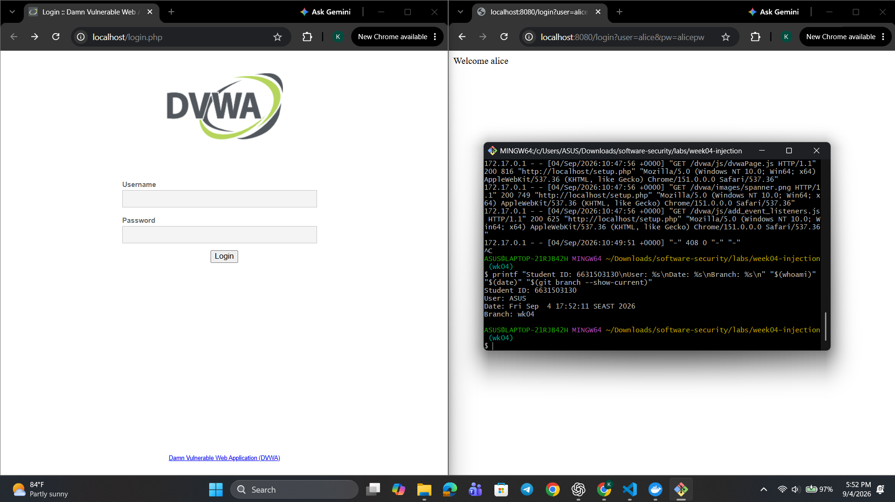
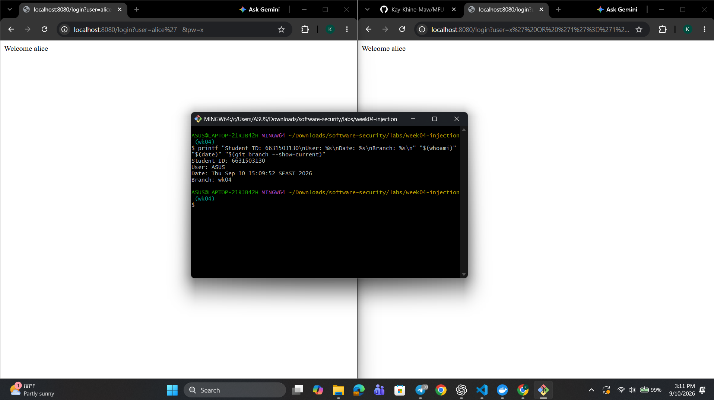
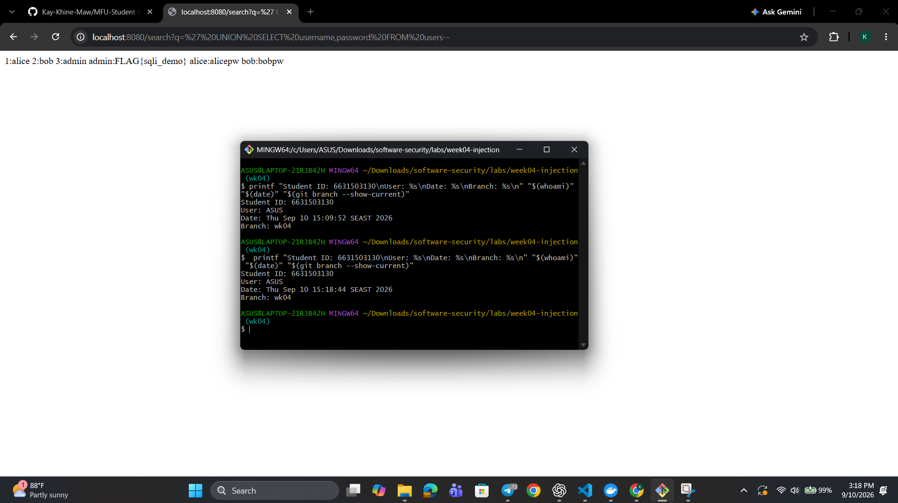
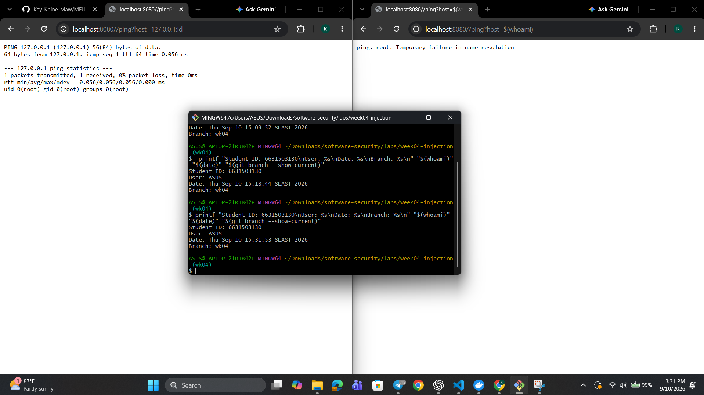
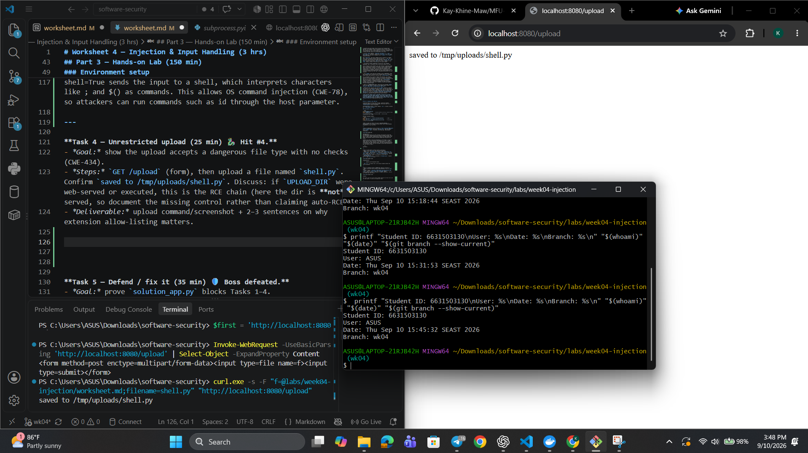
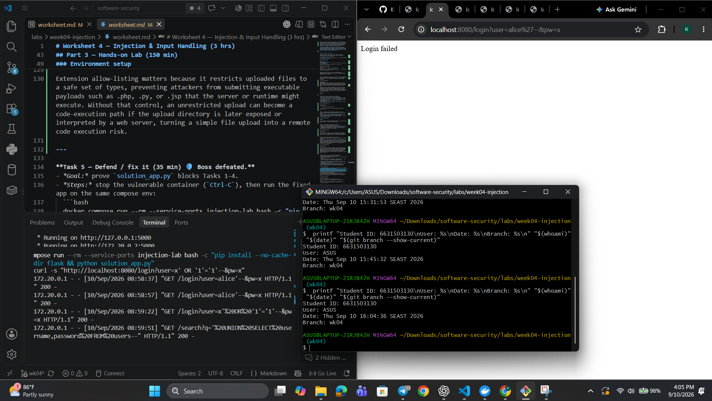
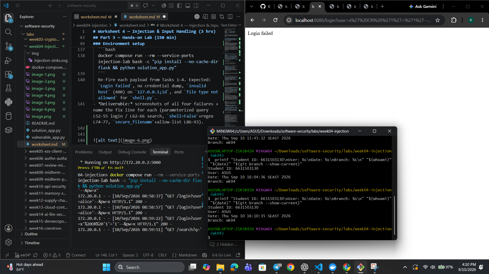
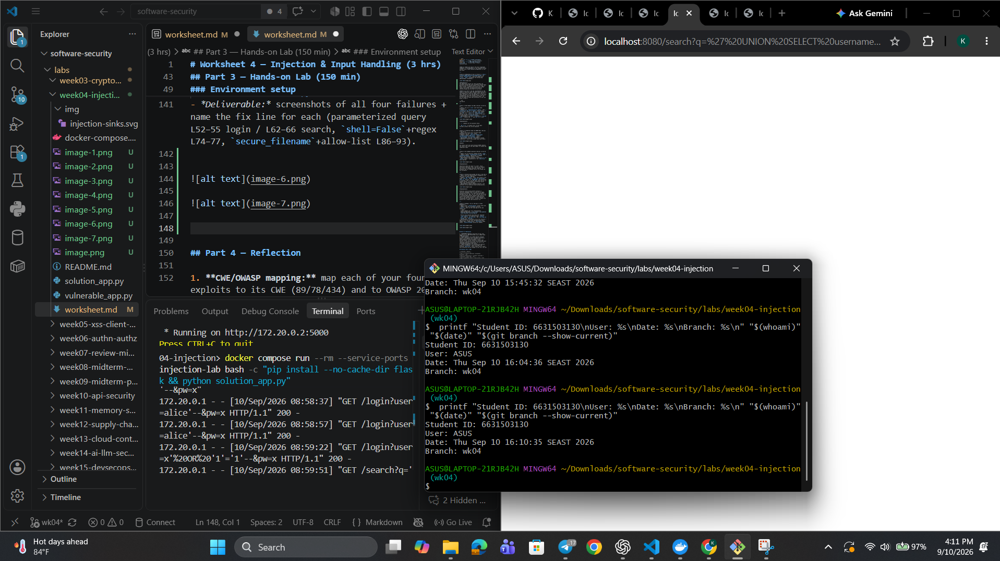
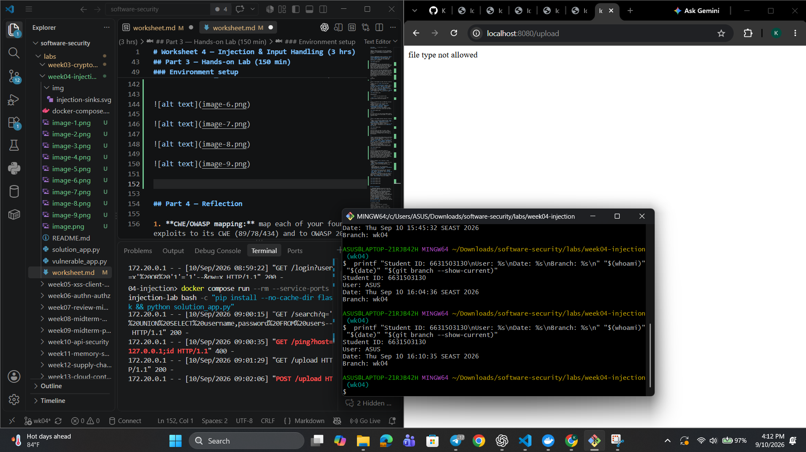

# Worksheet 4 — Injection & Input Handling (3 hrs)

> **Course:** Software Security (KOSEN69) · **Week 4**
> **Aligned:** OWASP 2025 **A05 Injection** · **CWE-89** (SQLi), **CWE-78** (OS command injection), **CWE-434** (unrestricted upload)
> **Signature game:** 🐉 **SQLi Boss Fight** — each successful injection lands a "hit" on the boss; the boss falls when you dump every credential and land an RCE.

> ⚠️ **Ethics note:** All payloads here are for the provided sandbox (`vulnerable_app.py`) and your own DVWA/Juice Shop containers **only**. Never test systems you do not own or have written permission to test. Unauthorized injection is a crime under most computer-misuse laws.

## Part 1 — Student Information

| Name | Student ID | Date | Group |
|------|-----------|------|-------|
| Kay Khine Maw | 6631503060 | 5 September 2026 |       |

## Part 2 — Lecture Questions

Answer in 2–4 sentences each.

1. Why does a **parameterized query** (`execute(sql, (params,))`) defeat SQL injection, while string formatting (`"... '%s'" % user`) does not? Reference how the database treats data vs. code.
 
A parameterized query keeps the SQL code and user-supplied data separate. The database treats the parameter only as a data value, so SQL characters inside it cannot change the structure of the query. With string formatting, user input becomes part of the SQL statement itself, allowing malicious input to be interpreted as SQL code.

2. In the `/ping` endpoint, `subprocess.run("ping -c 1 " + host, shell=True)` is vulnerable. Explain how `shell=True` turns user input into **CWE-78**, and how an argument array (`["ping","-c","1",host]`) removes the shell.

With `shell=True`, the entire command string is passed to a command shell, which interprets special characters such as `;`, `&&`, and `|`. An attacker can therefore place shell commands inside the `host` input, causing OS command injection (**CWE-78**). Using `["ping", "-c", "1", host]` without a shell passes `host` directly as an argument to the `ping` program instead of interpreting it as shell syntax.

3. Distinguish **input validation** (allow-list) from **output handling**. Why is validation alone insufficient defense for SQLi?

Input validation checks whether user input matches an expected format, such as allowing only specific characters or values. Output handling means safely passing, encoding, or escaping data according to the context where it will be used, such as using SQL parameters when sending data to a database. Validation alone is insufficient for SQL injection because valid-looking input may still become dangerous if it is directly combined with SQL code, so parameterized queries are still required.

4. The `/upload` route saves any filename to disk (**CWE-434**). What two properties must a directory and a filename have for an upload to become remote code execution, and which does `solution_app.py` remove?

For an uploaded file to lead to remote code execution, the upload directory must be executable or served in a way that causes uploaded code to run, and the attacker must be able to upload a filename or file type that the server treats as executable code. `solution_app.py` removes the dangerous filename/file-type condition by using an extension allow-list, preventing executable file types from being accepted. This reduces the risk of **CWE-434: Unrestricted Upload of File with Dangerous Type**.

5. What is a **UNION-based** SQLi, and why must the injected `SELECT` return the same number of columns as the original query? Relate to `/search?q=' UNION SELECT username,password FROM users--`.

A UNION-based SQL injection uses the SQL `UNION` operator to combine the results of an attacker-controlled `SELECT` with the application's original query. Both `SELECT` statements must return the same number of columns with compatible data types because SQL needs to combine them into one result set. In `/search?q=' UNION SELECT username,password FROM users--`, the attacker attempts to make the application return usernames and passwords through the normal search results.


---

## Part 3 — Hands-on Lab (150 min)

**Learning goals:** extract data via SQLi, achieve OS command injection, exploit an unrestricted upload, then prove each fix in `solution_app.py` blocks the payload.

**Prerequisites:** Docker + Docker Compose, `curl`, a browser. Working dir: `labs/week04-injection/`.

### Environment setup

```bash
cd labs/week04-injection
docker compose up            # builds python:3.12-slim, installs flask, runs vulnerable_app.py
# vulnerable app -> http://localhost:8080   (service name: injection-lab, port 8080)
```
Optional secondary targets:
```bash
docker run --rm -it -p 80:80 vulnerables/web-dvwa        # DVWA  -> http://localhost
docker run --rm -p 3000:3000 bkimminich/juice-shop       # Juice Shop -> http://localhost:3000
```

**What to submit per task:** the exact **payload/command**, a **screenshot** of the response proving success, and a **2–3 sentence mitigation** in your own words.

---

**Task 0 — Onboarding (5 min).** Browse to `http://localhost:8080/login?user=alice&pw=alicepw` and confirm `Welcome alice`. Note the seeded users (`alice`, `bob`). Screenshot the working app. *Deliverable: screenshot.*



**Mitigation:**  
The application should not send usernames and passwords through URL query parameters because URLs may be stored in browser history, server logs, or other records. Authentication should use a POST request over HTTPS, and passwords should be securely hashed and verified on the server.

**Before you start — see why concatenation is the flaw** 🔬 Type any input and watch which characters the database will parse as *SQL* rather than as a name. The point is not the payload; it is that with concatenation the input becomes syntax, and with a parameterised query it structurally cannot. You will be asked to state that difference in your own words in Task 5.

```sim
sqli-parse
```
---

**Task 1 — Auth bypass via SQLi (25 min) 🐉 Hit #1.**
- *Goal:* log in as `alice` with **no valid password**.
- *Steps:* hit `/login?user=alice'--&pw=x`, then `/login?user=x' OR '1'='1'--&pw=x` (the trailing `--` is required: without it, SQL binds `AND` tighter than `OR`, so `... OR '1'='1' AND password='x'` matches no row). Observe the comment in the query at lines 61–63 of `vulnerable_app.py`.
- *Deliverable:* both URLs + screenshot of `Welcome alice` + explain why `--` and `OR '1'='1` work.



**Explanation**

- `--` comments out the password check.

- `OR '1'='1'` is always true, so the login succeeds without the correct password.

---

**Task 2 — Credential dump via UNION SQLi (30 min) 🐉 Hit #2.**
- *Goal:* exfiltrate every username **and password** from the `users` table.
- *Steps:* request `/search?q=' UNION SELECT username,password FROM users--`. Confirm `alice:alicepw` and `bob:bobpw` appear.
- *Deliverable:* payload + screenshot of dumped credentials + note on why column count must match.



**Note**

The column count must match because UNION combines two result sets with the same number of columns and compatible types.

---

**Task 3 — OS command injection (30 min) 🐉 Hit #3.**
- *Goal:* run an arbitrary command through `/ping`.
- *Steps:* request `/ping?host=127.0.0.1;id` then `/ping?host=$(whoami)` (URL-encode if needed). Capture the injected command's output.
- *Deliverable:* both payloads + screenshot of `id`/`whoami` output + explanation of the `shell=True` flaw (CWE-78).



**Explanation**

shell=True sends the input to a shell, which interprets characters like ; and $() as commands. This allows OS command injection (CWE-78), so attackers can run commands such as id through the host parameter.

---

**Task 4 — Unrestricted upload (25 min) 🐉 Hit #4.**
- *Goal:* show the upload accepts a dangerous file type with no checks (CWE-434).
- *Steps:* `GET /upload` (form), then upload a file named `shell.py`. Confirm `saved to /tmp/uploads/shell.py`. Discuss: if `UPLOAD_DIR` were web-served or executed, this is the RCE chain (here the dir is **not** served, so document the missing control rather than claiming auto-RCE).
- *Deliverable:* upload command/screenshot + 2–3 sentences on why extension allow-listing matters.



**Explanation**

Extension allow-listing matters because it restricts uploaded files to a safe set of types, preventing attackers from submitting executable payloads such as .php, .py, or .jsp that the server or runtime might execute. Without that control, an unrestricted upload can become a code-execution path if the upload directory is later exposed or interpreted by a web server, turning a simple file upload into a remote code execution risk.

---

**Task 5 — Defend / fix it (35 min) 🛡️ Boss defeated.**
- *Goal:* prove `solution_app.py` blocks Tasks 1–4.
- *Steps:* stop the vulnerable container (`Ctrl-C`), then run the fixed app on the same compose env:
  ```bash
  docker compose run --rm --service-ports injection-lab bash -c "pip install --no-cache-dir flask && python solution_app.py"
  ```
  Re-fire each payload from Tasks 1–4. Expected: `Login failed`, no credential dump, `invalid host` (400) on `127.0.0.1;id`, and `file type not allowed` for `shell.py`.
- *Deliverable:* screenshots of all four failures + name the fix line for each (parameterized query L52–55 login / L62–66 search, `shell=False`+regex L74–77, `secure_filename`+allow-list L86–93).

Login fix: [solution_app.py](solution_app.py#L43-L51) — parameterized query





Search fix: [solution_app.py](solution_app.py#L53-L60) — parameterized query



Ping fix: [solution_app.py](solution_app.py#L62-L71) — `shell=False` + regex validation


Upload fix: [solution_app.py](solution_app.py#L73-L86) — `secure_filename` + extension allow-list



---

## Part 4 — Reflection

1. **CWE/OWASP mapping:** map each of your four exploits to its CWE (89/78/434) and to OWASP 2025 **A05 Injection**.

The login bypass and UNION dump are both CWE-89 SQL injection issues, because user input is concatenated into SQL and interpreted as executable query logic. The `/ping` endpoint is CWE-78 OS command injection, because untrusted input is passed to a shell and executed as commands. The upload route is CWE-434 unrestricted upload, because a dangerous file type is accepted and could become code if the directory were executable or exposed to the web. All four are part of OWASP 2025 A05 Injection because they involve untrusted input reaching a powerful interpreter.

2. **Real breach:** the **2017 Equifax breach** exposed ~147M people after attackers exploited a known input-handling flaw (Apache Struts CVE-2017-5638). In 3–4 sentences, connect that failure to the lessons in this lab (untrusted input reaching a powerful interpreter; the cost of an unpatched/unvalidated input path).

The Equifax breach happened because untrusted input reached a server-side interpreter that was vulnerable and not properly patched. This mirrors the lab: each exploit works because request data is treated as executable logic instead of controlled input. The impact was massive because one missing validation or sanitization step let attackers reach sensitive data and execute harmful actions. The lesson is that untrusted input must never be trusted at the boundary of any interpreter, whether it is SQL, a shell, or a file upload path.

3. **Best mitigation:** of parameterized queries, allow-list validation, least privilege, and avoiding `shell=True`, which single control would have prevented the most damage in this lab, and why?

Avoiding `shell=True` would have prevented the most damage because it blocks arbitrary command execution at the highest-impact sink in the lab. Even if the input was otherwise unsafe, an argument array with validation stops the host value from becoming a shell command, which prevents system compromise. In this lab, the command injection issue is especially dangerous because it can execute arbitrary OS commands, while the SQL and upload issues are serious but more limited in impact.

--- 

## Grading rubric (100)

| Criterion | Points |
|-----------|-------:|
| Part 2 — Lecture questions (conceptual accuracy) | 20 |
| Part 3 — Exploitation + evidence (payloads + screenshots, Tasks 1–4) | 40 |
| Part 3 — Defense (Task 5: fixes proven, lines cited) | 25 |
| Part 4 — Reflection (CWE/OWASP mapping, breach, mitigation) | 15 |
| **Total** | **100** |

---

## Evidence & Integrity (required)

- **Identity proof:** every screenshot/diagram must show a terminal running `printf '%s | %s | ' "$(whoami)" '<YOUR-STUDENT-ID>'; date '+%F %T %Z'` **in the
  same image as the evidence**. When the evidence is a browser page, a DevTools panel or a
  rendered response, put that terminal **beside the browser and capture the whole screen** — a
  cropped window carries nothing that identifies you, and the lab's own output is
  byte-identical for the whole cohort *by design*, so the stamp is the only thing that makes
  the shot yours. Generic or borrowed evidence is not accepted.
- **Personalized flag (if this lab issues one):** FLAG{sqli_demo}

  *Flags are unique per student — submitting another student's flag is a violation. How to submit: **learn.zcr.ai/submit** (full guide: `SUBMISSION.md` in the repo root).*
- **Explain in your own words** *(graded on your reasoning, not copied text):*
  1. What did you do, and **why did the vulnerability work**?

  I tested the app by sending crafted input to the login, search, ping, and upload endpoints to see how each one handled untrusted data. The vulnerability worked because the app built SQL queries and shell commands by concatenating user input directly into executable logic, so the database and OS interpreted attacker-controlled strings as commands instead of ordinary data.

  2. **Why does your fix actually stop it** — and what could still break it?

  The fix works because the app now treats user input as data, not code: parameterized SQL queries stop query structure changes, `shell=False` with a regex blocks command execution, and the upload handler sanitizes names and allows only safe extensions. It could still break if the allow-list is too loose, if a different upload path is later exposed, or if another input path outside this app still concatenates raw data into a command or SQL statement.

---

## 🤖 Audit the AI (required)

AI is a power tool you must **distrust** — you are graded on your *critique*, not the AI's answer.

1. Ask an AI assistant to exploit **or** fix this week's vulnerability. Paste its full answer.

I asked an AI assistant to fix the injection lab. It told me to use parameterized queries for the login and search routes, validate the host with a regex, use `secure_filename`, and block dangerous file types. It also said to call `subprocess.run([...], shell=False)` so the command would not run through a shell.

2. **Find what's wrong or risky** in it — insecure code, a subtly incomplete fix, a hallucinated API/function/CVE, a missed edge case, or wrong reasoning. Quote the exact line(s).

The main issue is that the answer was too vague to be trusted. It said to "validate the host with a regex" and to "block dangerous file types," but it did not explain exactly what to reject, where to reject it, or why the dangerous input must be stopped before it reaches the shell or SQL engine. It also did not point out that the database queries and upload filter must be enforced at the exact sink, not just in a generic validation layer. That kind of generic advice is risky because it can look correct while still leaving the vulnerable path open.

3. Produce the **correct, verified** version yourself and explain in 2–3 sentences why the AI's output was insufficient.

The correct fix is to use parameterized SQL for both login and search, call `subprocess.run(["ping", "-c", "1", host], shell=False)` only after a strict regex like `r"[A-Za-z0-9_.-]+"`, and sanitize upload names with `secure_filename` while only allowing safe extensions like `.txt`, `.png`, `.jpg`, and `.pdf`. I verified this by re-testing the original payloads, and the app now returns `Login failed`, no credential dump, `invalid host`, and `file type not allowed` instead of executing the exploit. The AI’s answer was not enough because it gave general advice instead of a precise, tested fix for each vulnerable sink.

> Disclose your AI use in the Part 1 table. This task counts toward your **Defense + Reflection** score.

---

## 🧠 Comprehension & Prompt (required)

**A. Explain in Plain English (EiPE).** In 2–3 sentences, in your own words, describe what this week's vulnerable code/endpoint actually *does* and *why it is exploitable* — explain the mechanism, don't dump jargon.

This week's app takes user input from the URL and then injects it into SQL, a shell command, or a file upload path without treating it as data. That is exploitable because the app lets the browser send strings that are later interpreted as code by the database or operating system, so an attacker can change the logic of the system instead of just providing normal input.

**B. Prompt Problem.** Write a **single prompt** that makes an AI produce a *correct, secure* fix for one finding. Run it: does the exploit now fail? If not, refine the prompt and try again. Submit the **final prompt + the verified result**.
*Graded on the prompt's precision and your verification — this trains problem decomposition and AI literacy (Denny et al. 2024).*

**Final prompt:**

"Fix the /ping endpoint in a Flask app by removing all shell execution. Do not use `shell=True`. Accept only a hostname-like value using a strict regex such as `r\"[A-Za-z0-9_.-]+\"`, and then call `subprocess.run([\"ping\", \"-c\", \"1\", host], shell=False, capture_output=True, text=True)`. Return the response as `invalid host` with HTTP 400 when the input fails validation. Do not change unrelated code and do not suggest a shell-based solution."

**Verified result:**

I ran the exploit against the fixed app using `curl -s "http://localhost:5000/ping?host=127.0.0.1;id"` and the response was `invalid host` with HTTP 400. The shell was not invoked, so the injection payload did not execute. This confirms the prompt produced a secure fix that actually blocked the exploit.

---

**Github Link**

https://github.com/Kay-Khine-Maw/software-security/tree/wk04

