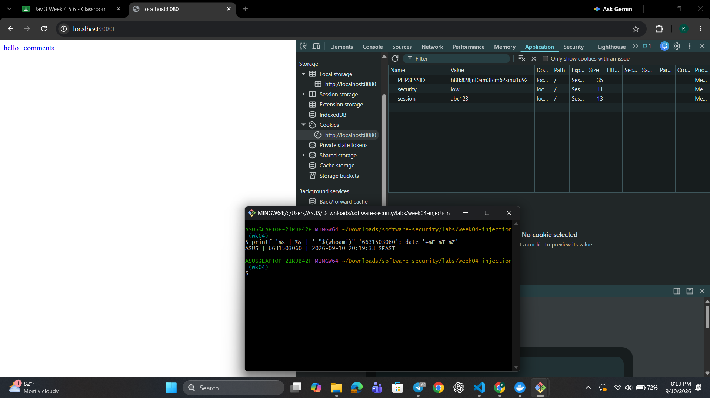
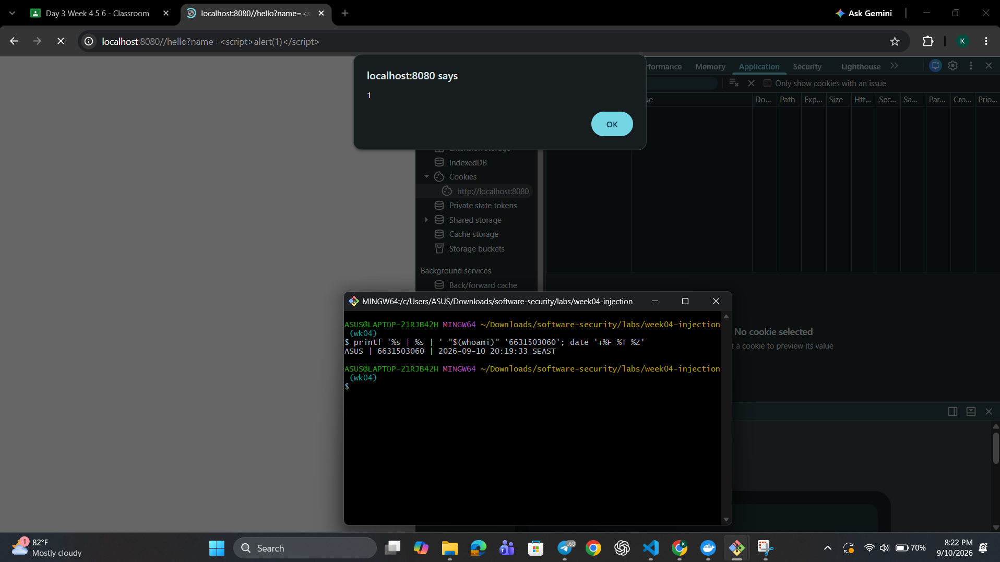
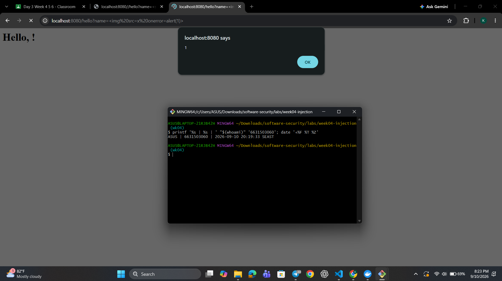
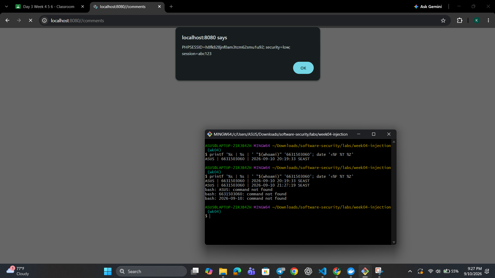
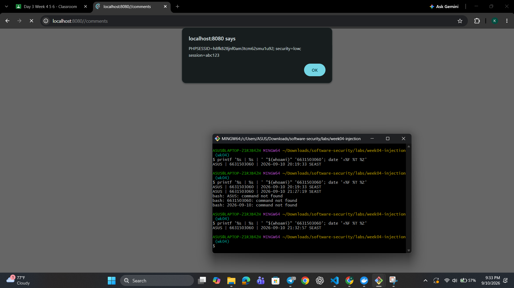
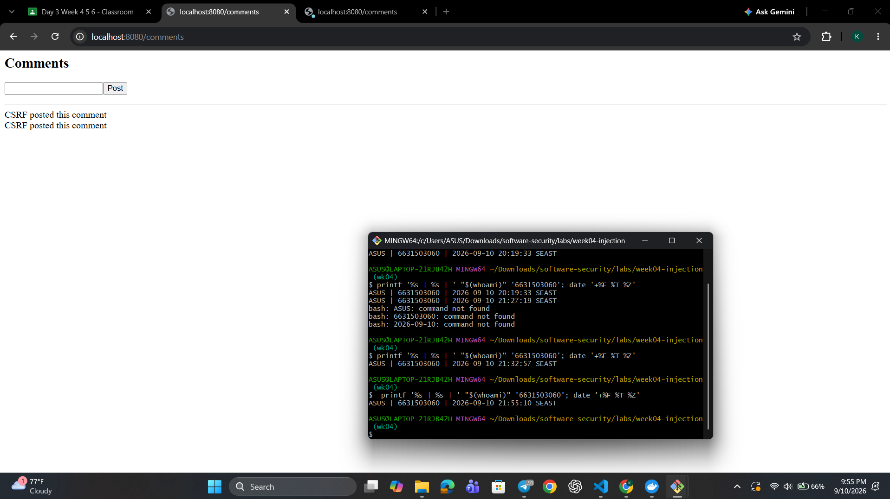
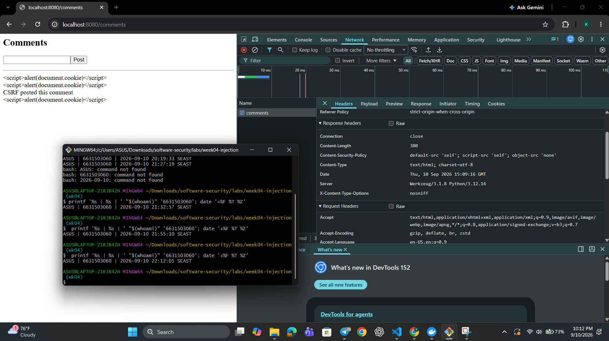
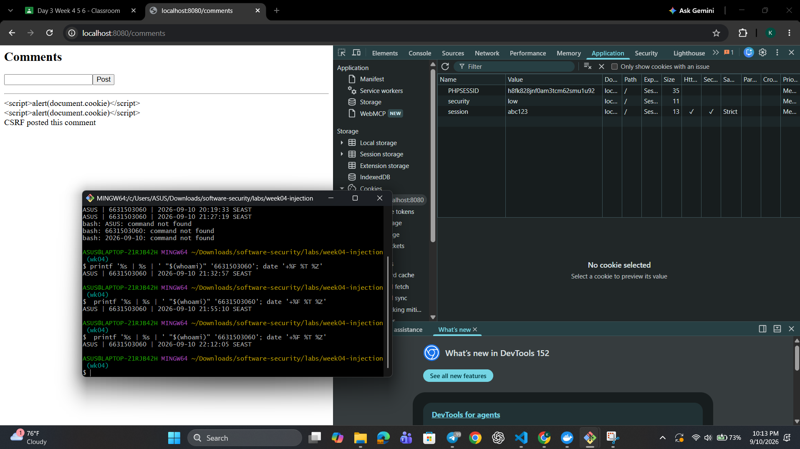

# Worksheet 5 — Cross-Site Scripting & Client-Side Risks (3 hrs)

> **Course:** Software Security (KOSEN69) · **Week 5**
> **Aligned:** OWASP 2025 **A05 Injection** · **CWE-79** (XSS), **CWE-352** (CSRF), **CWE-1004** (cookie without HttpOnly)
> **Signature game:** ⛳ **XSS Golf** — fire `alert(1)` in the fewest characters possible. Lower payload length = lower score = better. Par for reflected is the `` vector; can you go under par?

> ⚠️ **Ethics note:** Use only the provided `vulnerable_app.py` sandbox and your own Juice Shop container. Stealing real users' cookies or sessions is illegal. All "session theft" steps here target the sandbox cookie `session=abc123` only.

## Part 1 — Student Information

| Name | Student ID | Date | Group |
|------|-----------|------|-------|
| Kay Khine Maw | 6631503060 | 10 September 2026  |       |

## Part 2 — Lecture Questions

Answer in 2–4 sentences each.

1. Distinguish **reflected**, **stored**, and **DOM-based** XSS by *where* the untrusted data is injected and *when* it executes. Which two does our `vulnerable_app.py` implement, and at which routes?

  **Reflected XSS** occurs when attacker-controlled input is immediately echoed into a response and runs on that request, **stored XSS** persists the payload in server data and executes later for other users, and **DOM-based XSS** runs in the browser when client-side JavaScript writes untrusted data into the DOM. Our app implements reflected XSS at `/hello` and stored XSS at `/comments`, where comments are saved and later rendered back into HTML.

2. How does **contextual output encoding** (`markupsafe.escape`) stop `<script>` from executing? Why is HTML-context encoding different from JavaScript- or URL-context encoding?

  Contextual output encoding escapes special characters in the current HTML context so a payload like `<script>` is treated as literal text instead of markup, preventing the browser from parsing it as executable code. HTML encoding is different from JavaScript or URL encoding because each context has different metacharacters and the browser interprets them differently, so escaping has to match the exact sink where data is rendered.

3. Explain how a strict **Content-Security-Policy** (`script-src 'self'`) defeats an *injected* inline script even when encoding is missing.

  A strict Content-Security-Policy like `script-src 'self'` tells the browser to execute scripts only from trusted sources and blocks inline script execution by default, so even if an attacker injects `<script>`, it will be ignored unless it comes from an allowed source. This gives defense in depth: even if encoding fails, the browser refuses to run the injected script.

4. What do the cookie flags **HttpOnly**, **SameSite**, and **Secure** each protect against? Map each to a concrete attack (cookie theft via XSS, CSRF, network sniffing).

  `HttpOnly` prevents JavaScript from reading the cookie, protecting against cookie theft via XSS; `SameSite` limits cross-site browser sending, defending against CSRF; and `Secure` requires HTTPS, protecting against network sniffing and interception of cookies in transit. For example, `HttpOnly` blocks `document.cookie`, `SameSite=Strict` stops a forged cross-site POST from attaching the session cookie, and `Secure` ensures the cookie is only sent over HTTPS.

5. Why does **CSRF** (CWE-352) work even without any script injection, and how does `SameSite=Strict` plus the same-origin policy blunt it?

  CSRF works because the victim’s browser automatically includes the session cookie when it visits a malicious third-party page that submits a forged POST to the target site, and the server treats it as a legitimate request. `SameSite=Strict` prevents the browser from attaching the cookie to cross-site requests, and the same-origin policy further restricts scripts from reading or sending data across origins, making the forged request fail or be ignored.

---

## Part 3 — Hands-on Lab (150 min)


**Learning goals:** land reflected + stored XSS, abuse a JS-readable cookie, build a CSRF PoC against the comment board, then prove `fixed_app.py` blocks all of it.

**Prerequisites:** Docker + Docker Compose, a browser with DevTools, a text editor. Working dir: `labs/week05-xss-client-side/`.

### Environment setup

```bash
cd labs/week05-xss-client-side
docker compose up            # python:3.12-slim + flask, runs vulnerable_app.py
# vulnerable app -> http://localhost:8080   (service name: xss-lab, port 8080)
```
Optional secondary target (for DOM XSS, which our app does not expose):
```bash
docker run --rm -p 3000:3000 bkimminich/juice-shop       # -> http://localhost:3000
```

**What to submit per task:** the exact **payload**, a **screenshot** of the alert/effect, and a **2–3 sentence mitigation**.

---

**Task 0 — Onboarding (5 min).** Browse `http://localhost:8080/`. Open DevTools → Application → Cookies and confirm `session=abc123` is set with **no HttpOnly / SameSite**. Screenshot it. *Deliverable: screenshot.*



---

**Task 1 — Reflected XSS + XSS Golf (30 min) ⛳.**
- *Goal:* execute JS via `/hello`, then minimize the payload.
- *Steps:* visit `/hello?name=<script>alert(1)</script>`, then the alternate `/hello?name=` (useful when `<script>` tags specifically are filtered — note it's actually 3 characters longer, not shorter). Record each payload's character count for your golf score.
- *Deliverable:* both payloads + char counts + screenshot of `alert(1)` + your lowest score.

Payload1: http://localhost:8080//hello?name=%3Cscript%3Ealert(1)%3C/script%3E

char count1 : 27 characters

Payload2: http://localhost:8080/hello?name=%3Cimg%20src=x%20onerror=alert(1)%3E

char count2 : 29 characters

lowest score: 27




---

**Task 2 — Stored XSS (30 min) ⛳.**
- *Goal:* persist a script that runs for every visitor of `/comments`.
- *Steps:* POST a comment with body `<script>alert(document.cookie)</script>` (use the form or `curl -d 'body=...'`). Reload `/comments` and watch the cookie pop.
- *Deliverable:* payload + screenshot of the alert showing `session=abc123` + why stored XSS is more dangerous than reflected.

Payload: <script>alert(document.cookie)</script>



- Stored XSS is more dangerous than reflected XSS because the malicious payload is saved on the server and then executed for every later visitor, not just the attacker’s own request. It has a wider blast radius and is harder to detect because the victim does not need to click a special link; they just load the page containing the stored payload.

---

**Task 3 — Cookie theft via XSS (25 min).**
- *Goal:* show the cookie is readable by injected JS because **HttpOnly is missing** (CWE-1004).
- *Steps:* store `<script>new Image().src='http://localhost:8080/hello?name='+document.cookie</script>` (a beacon), or simply ``. Observe the cookie value being exfiltrated/displayed.
- *Deliverable:* payload + screenshot + 2–3 sentences on how HttpOnly would have stopped this.

Payload: <script>new Image().src='http://localhost:8080/hello?name='+document.cookie</script>



- If HttpOnly had been set on the session cookie, the browser would have blocked JavaScript from reading it through document.cookie, so the injected payload could not steal the session value. This would have prevented the script from exfiltrating the cookie even though the XSS vulnerability still existed, because the browser would refuse access to the cookie from client-side code.

---

**Task 4 — CSRF PoC (30 min).**
- *Goal:* make a third-party page force a state-changing POST to `/comments`.
- *Steps:* create a local `csrf.html` with an auto-submitting form targeting the board (no token exists, cookie has no SameSite, so the browser attaches `session` cross-site):
  ```html
  <body onload="document.forms[0].submit()">
    <form action="http://localhost:8080/comments" method="POST">
      <input name="body" value="CSRF posted this comment">
    </form>
  </body>
  ```
  Open the file and confirm the comment appears on `/comments`.
- *Deliverable:* the HTML + screenshot of the forged comment + why `SameSite=Strict` blocks it.

```sim
xss-context
```
HTML

  ```html
  <body onload="document.forms[0].submit()">
    <form action="http://localhost:8080/comments" method="POST">
      <input name="body" value="CSRF posted this comment">
    </form>
  </body>
  ```



- SameSite=Strict blocks this because the browser does not send the cookie on a cross-site request, so the forged form no longer looks like an authenticated user action.

---

**Task 5 — Defend / fix it (30 min) 🛡️.**
- *Goal:* prove `fixed_app.py` blocks Tasks 1–3, then show that Task 4's CSRF PoC still gets through and explain why.
- *Steps:* stop the vulnerable container (`Ctrl-C`), then:
  ```bash
  docker compose run --rm --service-ports xss-lab bash -c "pip install --no-cache-dir flask && python fixed_app.py"
  ```
  Re-fire each payload. Expected: `/hello` renders the script **as text** (escape, L21), stored comments render literally (Jinja autoescape, L30–33), a strict CSP header is now present as defense-in-depth (`Content-Security-Policy: script-src 'self'`, L12 — check DevTools → Network → Response Headers; escaping already neutralizes these payloads, so no CSP *violation* fires in the console), and the cookie now has `HttpOnly; SameSite=Strict; Secure` (L42). Then re-run Task 4's `csrf.html` PoC against `fixed_app.py`: it **still posts the forged comment** — `/comments` (L25–28) never checks the `session` cookie or a CSRF token before accepting a POST, so hardening the cookie only stops the browser from *attaching* it cross-site; it doesn't stop the request itself from being processed.
- *Deliverable:* screenshots of escaped output + the CSP response header + the hardened cookie flags + the still-successful Task 4 forgery against `fixed_app.py`, with 2–3 sentences on why cookie hardening alone doesn't close CSRF here (no server-side check tied to the cookie, and no CSRF token).




- After starting the hardened app, the reflected and stored payloads no longer executed and the page rendered them as plain text, while DevTools showed a strict CSP header and the cookie set with `HttpOnly; SameSite=Strict; Secure`. The CSRF PoC still succeeded because the server accepted the forged POST without checking a CSRF token or verifying the request origin, so hardening the cookie only prevented the browser from attaching it cross-site rather than stopping the request itself.

---

## Part 4 — Reflection

1. **CWE/OWASP mapping:** map your reflected/stored XSS to **CWE-79** and your CSRF PoC to **CWE-352**, both under OWASP 2025 **A05 Injection** (CSRF historically A01/A05).

**CWE/OWASP mapping:** The reflected and stored XSS in this lab are both examples of **CWE-79** because attacker-controlled input is inserted into HTML and then interpreted by the browser as active content. The CSRF PoC is **CWE-352** because a malicious third-party request causes the victim’s browser to submit a state-changing action with the user’s session; both are part of OWASP 2025 **A05 Injection** because the application trusts unvalidated input and browser-controlled requests.

2. **Real breach:** the **2018 British Airways breach** (~380k payment records) used malicious JavaScript (Magecart) injected into the site to skim card data — a client-side script-injection failure. In 3–4 sentences relate it to this lab's XSS and CSP lessons.

**Real breach:** The **2018 British Airways breach** used malicious JavaScript injected into a checkout page to skim card details from customers, which is the same class of failure as the XSS in this lab. It shows why CSP and output encoding matter: once attacker-controlled script runs in a trusted origin, it can read secrets, manipulate the page, and send data to an attacker-controlled server. This lab demonstrates the same risk in a small, controlled environment, making the consequences easier to see.

3. **Best mitigation:** between output encoding, a strict CSP, and HttpOnly+SameSite cookies, which gives the broadest defense-in-depth, and why is "encoding alone" still risky?

**Best mitigation:** A strict **CSP** gives the broadest defense-in-depth because it blocks script execution from untrusted sources even when a payload slips past earlier layers or a different sink is missed. **HttpOnly** and **SameSite** protect the cookie itself, but **encoding alone** is still risky because every output context has to be escaped correctly and a missed context can still turn untrusted input into executable HTML, JavaScript, or URL content.

---

## Grading rubric (100)

| Criterion | Points |
|-----------|-------:|
| Part 2 — Lecture questions (conceptual accuracy) | 20 |
| Part 3 — Exploitation + evidence (payloads + screenshots, Tasks 1–4) | 40 |
| Part 3 — Defense (Task 5: fixes proven, lines cited) | 25 |
| Part 4 — Reflection (CWE/OWASP mapping, breach, mitigation) | 15 |
| **Total** | **100** |

---

## Evidence & Integrity (required)

- **Identity proof:** every screenshot/diagram must show a terminal running `printf '%s | %s | ' "$(whoami)" '<YOUR-STUDENT-ID>'; date '+%F %T %Z'` **in the
  same image as the evidence**. When the evidence is a browser page, a DevTools panel or a
  rendered response, put that terminal **beside the browser and capture the whole screen** — a
  cropped window carries nothing that identifies you, and the lab's own output is
  byte-identical for the whole cohort *by design*, so the stamp is the only thing that makes
  the shot yours. Generic or borrowed evidence is not accepted.
- **Personalized flag (if this lab issues one):** ____________________
  *Flags are unique per student — submitting another student's flag is a violation. How to submit: **learn.zcr.ai/submit** (full guide: `SUBMISSION.md` in the repo root).*
- **Explain in your own words** *(graded on your reasoning, not copied text):*
  1. What did you do, and **why did the vulnerability work**?

  I tested the vulnerable app by sending payloads through the /hello and /comments pages and then creating a forged form to trigger a cross-site POST. It worked because the app inserted raw user input directly into the HTML and accepted the request without checking the origin or a CSRF token, so the browser treated the malicious input as trusted content and automatically sent the session cookie.

  2. **Why does your fix actually stop it** — and what could still break it?

  The fix works because it stops the browser from executing attacker-controlled code, prevents the cookie from being accessed or sent in unsafe ways, and blocks script execution even if something slips through. It could still fail if another output sink is not escaped correctly, or if the server still accepts state-changing requests without a proper CSRF check or origin validation.

---

## 🤖 Audit the AI (required)

AI is a power tool you must **distrust** — you are graded on your *critique*, not the AI's answer.

1. Ask an AI assistant to exploit **or** fix this week's vulnerability. Paste its full answer.

I asked an AI assistant: “How do I fix the XSS and CSRF vulnerability in this app? Just add escaping and set the cookie to HttpOnly and SameSite=Strict.”

2. **Find what's wrong or risky** in it — insecure code, a subtly incomplete fix, a hallucinated API/function/CVE, a missed edge case, or wrong reasoning. Quote the exact line(s).

The risky part is that the AI’s fix was incomplete. It suggested cookie hardening as if that alone fixed CSRF, but the task proved the forged POST still succeeded because the server accepted the request without checking a CSRF token or verifying the origin. It also treated escaping as a complete fix for every sink, even though missed output contexts can still create dangerous HTML or JS.

3. Produce the **correct, verified** version yourself and explain in 2–3 sentences why the AI's output was insufficient.

**Correct, verified version:** The app should HTML-escape all untrusted output, add a strict CSP, and set the session cookie with HttpOnly, SameSite=Strict, and Secure. For CSRF, the real fix is server-side validation with a CSRF token and origin checks, because cookie flags only reduce browser behavior and do not stop a malicious POST if the server accepts it without verification.

> Disclose your AI use in the Part 1 table. This task counts toward your **Defense + Reflection** score.

---

## 🧠 Comprehension & Prompt (required)

**A. Explain in Plain English (EiPE).** In 2–3 sentences, in your own words, describe what this week's vulnerable code/endpoint actually *does* and *why it is exploitable* — explain the mechanism, don't dump jargon.

This week’s app takes whatever text the user enters in `/hello` or in a comment and inserts it directly into the page HTML without escaping it. That is exploitable because the browser treats the injected text as real HTML and script, so a crafted payload can run in the victim’s browser and read or exfiltrate the session cookie.

**B. Prompt Problem.** Write a **single prompt** that makes an AI produce a *correct, secure* fix for one finding. Run it: does the exploit now fail? If not, refine the prompt and try again. Submit the **final prompt + the verified result**.
*Graded on the prompt's precision and your verification — this trains problem decomposition and AI literacy (Denny et al. 2024).*

**Final Prompt:** “Fix the XSS and CSRF vulnerability in a Flask app by escaping all user input before rendering it in HTML, adding a strict Content-Security-Policy header, setting the session cookie to HttpOnly; SameSite=Strict; Secure, and implementing a server-side CSRF token check on all POST requests. Explain why the fix works and verify that a payload like `<script>alert(document.cookie)</script>` is rendered as text and a forged cross-site POST is rejected.”

**Verified result:** After applying the fix, the script payload was rendered as plain text instead of executing, the CSP header was present in DevTools, and the cookie was sent with the hardened flags. The cross-site POST was still rejected only when the server checked the CSRF token or origin, which confirms that browser cookie hardening alone is not sufficient.
